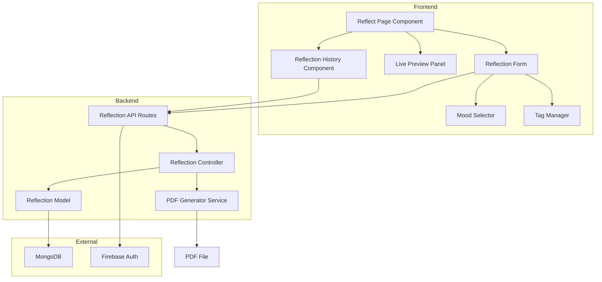

# Design Document: Reflection Feature

## Overview

The Reflection feature provides a journaling capability within the practice tracking application, allowing users to capture thoughts, emotions, and insights about their practice sessions. The feature consists of a React-based frontend interface for creating and viewing reflections, a MongoDB schema for data persistence, and Express API endpoints for CRUD operations and PDF export functionality.

The design follows the existing MERN stack architecture with Firebase authentication, ensuring seamless integration with the current application structure. The feature emphasizes real-time user feedback through live preview, intuitive mood and tag selection, and efficient data management.

## Architecture

### System Components



### Data Flow

1. **Create Reflection Flow:**
   - User types in text area → Live preview updates in real-time
   - User selects mood and adds tags → Form state updates
   - User clicks save → POST request to `/api/reflections`
   - Backend validates authentication → Creates reflection document
   - MongoDB stores reflection → Returns success response
   - Frontend updates UI and shows confirmation

2. **View Reflections Flow:**
   - User navigates to history → GET request to `/api/reflections`
   - Backend validates authentication → Queries user's reflections
   - MongoDB returns sorted reflections → Backend sends to frontend
   - Frontend displays list with timestamps and previews

3. **Delete Reflection Flow:**
   - User clicks delete → Confirmation dialog appears
   - User confirms → DELETE request to `/api/reflections/:id`
   - Backend validates ownership → Removes from MongoDB
   - Frontend updates list to exclude deleted reflection

4. **Export to PDF Flow:**
   - User clicks export → GET request to `/api/reflections/:id/pdf`
   - Backend retrieves reflection → Generates PDF using library
   - PDF sent as downloadable file → Browser triggers download

### Technology Stack

- **Frontend:** React, React Router, Tailwind CSS
- **Backend:** Node.js, Express.js
- **Database:** MongoDB with Mongoose ODM
- **Authentication:** Firebase Authentication
- **PDF Generation:** PDFKit or similar Node.js PDF library
- **State Management:** React hooks (useState, useEffect)

## Components and Interfaces

### Frontend Components

#### 1. ReflectPage Component

Main container component for the reflection creation interface.

**Props:** None (uses authentication context)

**State:**
```javascript
{
  content: string,           // Reflection text content
  mood: string | null,       // Selected mood (Happy, Neutral, Sad, Energized, Thoughtful)
  tags: string[],           // Array of tag strings
  lastUpdated: Date | null, // Timestamp of last save
  isSaving: boolean,        // Save operation in progress
  error: string | null      // Error message if save fails
}
```

**Key Methods:**
- `handleContentChange(text)`: Updates content and triggers preview update
- `handleMoodSelect(mood)`: Updates selected mood
- `handleTagAdd(tag)`: Adds tag to tags array
- `handleTagRemove(tag)`: Removes tag from tags array
- `handleSave()`: Sends reflection data to backend API
- `getRelativeTime()`: Formats timestamp as relative time string

#### 2. ReflectionForm Component

Form component containing text area, mood selector, and tag manager.

**Props:**
```javascript
{
  content: string,
  mood: string | null,
  tags: string[],
  onContentChange: (text: string) => void,
  onMoodSelect: (mood: string) => void,
  onTagAdd: (tag: string) => void,
  onTagRemove: (tag: string) => void,
  onSave: () => void,
  isSaving: boolean
}
```

#### 3. LivePreview Component

Real-time preview panel showing formatted reflection content.

**Props:**
```javascript
{
  content: string,
  mood: string | null,
  tags: string[],
  lastUpdated: Date | null
}
```

**Behavior:**
- Updates within 100ms of content changes using debouncing
- Displays mood emoji if mood is selected
- Shows tags as styled badges
- Formats timestamp as "Last updated: just now" or relative time

#### 4. MoodSelector Component

Mood selection interface with emoji icons.

**Props:**
```javascript
{
  selectedMood: string | null,
  onMoodSelect: (mood: string) => void
}
```

**Mood Options:**
```javascript
const MOODS = [
  { value: 'Happy', emoji: '😊' },
  { value: 'Neutral', emoji: '😐' },
  { value: 'Sad', emoji: '😢' },
  { value: 'Energized', emoji: '⚡' },
  { value: 'Thoughtful', emoji: '🤔' }
];
```

#### 5. TagManager Component

Interface for adding and removing tags.

**Props:**
```javascript
{
  tags: string[],
  onTagAdd: (tag: string) => void,
  onTagRemove: (tag: string) => void
}
```

**State:**
```javascript
{
  inputValue: string  // Current tag input value
}
```

**Key Methods:**
- `handleKeyPress(event)`: Adds tag on Enter key press
- `handleRemove(tag)`: Removes tag from list

#### 6. ReflectionHistory Component

List view of saved reflections.

**Props:** None (fetches data internally)

**State:**
```javascript
{
  reflections: Reflection[],
  isLoading: boolean,
  error: string | null,
  selectedReflection: Reflection | null
}
```

**Key Methods:**
- `fetchReflections()`: Retrieves reflections from API
- `handleDelete(id)`: Deletes reflection with confirmation
- `handleExport(id)`: Triggers PDF export
- `handleSelect(reflection)`: Shows full reflection details

### Backend Components

#### 1. Reflection Model (MongoDB Schema)

```javascript
const reflectionSchema = new mongoose.Schema({
  userId: {
    type: String,
    required: true,
    index: true
  },
  content: {
    type: String,
    required: true,
    maxlength: 10000
  },
  mood: {
    type: String,
    enum: ['Happy', 'Neutral', 'Sad', 'Energized', 'Thoughtful', null],
    default: null
  },
  tags: [{
    type: String,
    maxlength: 50
  }],
  createdAt: {
    type: Date,
    default: Date.now,
    required: true
  },
  updatedAt: {
    type: Date,
    default: Date.now,
    required: true
  }
});

// Index for efficient querying by user and date
reflectionSchema.index({ userId: 1, createdAt: -1 });
```

#### 2. Reflection Controller

Handles business logic for reflection operations.

**Methods:**

```javascript
// Create new reflection
async createReflection(userId, reflectionData) {
  // Validates input data
  // Creates reflection document with userId
  // Returns created reflection with timestamps
}

// Get all reflections for user
async getReflections(userId) {
  // Queries reflections by userId
  // Sorts by createdAt descending
  // Returns array of reflections
}

// Get single reflection by ID
async getReflectionById(userId, reflectionId) {
  // Validates ownership (userId matches)
  // Returns reflection or throws authorization error
}

// Update reflection
async updateReflection(userId, reflectionId, updateData) {
  // Validates ownership
  // Updates reflection fields
  // Updates updatedAt timestamp
  // Returns updated reflection
}

// Delete reflection
async deleteReflection(userId, reflectionId) {
  // Validates ownership
  // Removes reflection from database
  // Returns success confirmation
}
```

#### 3. PDF Generator Service

Generates PDF documents from reflection data.

**Method:**

```javascript
async generateReflectionPDF(reflection) {
  // Creates PDF document using PDFKit
  // Adds reflection content with formatting
  // Includes mood emoji and tags
  // Adds timestamp
  // Returns PDF buffer for download
}
```

**PDF Layout:**
- Title: "Reflection"
- Date and time at top
- Mood emoji (if present)
- Tags as comma-separated list
- Reflection content with proper line breaks
- Footer with application name

### API Endpoints

#### POST /api/reflections
Create a new reflection.

**Request Body:**
```javascript
{
  content: string,      // Required, max 10000 chars
  mood: string | null,  // Optional, must be valid mood value
  tags: string[]        // Optional, array of strings
}
```

**Response (201):**
```javascript
{
  _id: string,
  userId: string,
  content: string,
  mood: string | null,
  tags: string[],
  createdAt: string,
  updatedAt: string
}
```

**Error Responses:**
- 401: Unauthorized (not authenticated)
- 400: Bad Request (validation error)
- 500: Internal Server Error

#### GET /api/reflections
Get all reflections for authenticated user.

**Query Parameters:** None

**Response (200):**
```javascript
[
  {
    _id: string,
    userId: string,
    content: string,
    mood: string | null,
    tags: string[],
    createdAt: string,
    updatedAt: string
  }
]
```

**Error Responses:**
- 401: Unauthorized
- 500: Internal Server Error

#### GET /api/reflections/:id
Get a single reflection by ID.

**Path Parameters:**
- `id`: Reflection ID

**Response (200):**
```javascript
{
  _id: string,
  userId: string,
  content: string,
  mood: string | null,
  tags: string[],
  createdAt: string,
  updatedAt: string
}
```

**Error Responses:**
- 401: Unauthorized
- 403: Forbidden (not owner)
- 404: Not Found
- 500: Internal Server Error

#### DELETE /api/reflections/:id
Delete a reflection.

**Path Parameters:**
- `id`: Reflection ID

**Response (200):**
```javascript
{
  message: "Reflection deleted successfully"
}
```

**Error Responses:**
- 401: Unauthorized
- 403: Forbidden (not owner)
- 404: Not Found
- 500: Internal Server Error

#### GET /api/reflections/:id/pdf
Export reflection as PDF.

**Path Parameters:**
- `id`: Reflection ID

**Response (200):**
- Content-Type: application/pdf
- Content-Disposition: attachment; filename="reflection-{date}.pdf"
- Body: PDF file buffer

**Error Responses:**
- 401: Unauthorized
- 403: Forbidden (not owner)
- 404: Not Found
- 500: Internal Server Error

## Data Models

### Reflection Document

The core data structure stored in MongoDB.

**Fields:**

| Field | Type | Required | Description |
|-------|------|----------|-------------|
| _id | ObjectId | Auto | MongoDB document ID |
| userId | String | Yes | Firebase user ID (indexed) |
| content | String | Yes | Reflection text (max 10000 chars) |
| mood | String | No | One of: Happy, Neutral, Sad, Energized, Thoughtful |
| tags | Array[String] | No | Custom tags (max 50 chars each) |
| createdAt | Date | Yes | Creation timestamp (UTC) |
| updatedAt | Date | Yes | Last modification timestamp (UTC) |

**Indexes:**
- Primary: `_id`
- Compound: `{ userId: 1, createdAt: -1 }` for efficient user queries sorted by date

**Validation Rules:**
- `content`: Non-empty string, max 10000 characters
- `mood`: Must be one of the five valid mood values or null
- `tags`: Each tag max 50 characters, array can be empty
- `userId`: Must match authenticated user's Firebase ID
- `createdAt`: Automatically set on creation, immutable
- `updatedAt`: Automatically updated on modification

### Frontend State Models

#### ReflectionFormState

```typescript
interface ReflectionFormState {
  content: string;
  mood: 'Happy' | 'Neutral' | 'Sad' | 'Energized' | 'Thoughtful' | null;
  tags: string[];
  lastUpdated: Date | null;
  isSaving: boolean;
  error: string | null;
}
```

#### ReflectionListItem

```typescript
interface ReflectionListItem {
  _id: string;
  content: string;
  mood: string | null;
  tags: string[];
  createdAt: string;
  updatedAt: string;
  preview: string;  // First 150 characters of content
}
```

## Correctness Properties

*A property is a characteristic or behavior that should hold true across all valid executions of a system—essentially, a formal statement about what the system should do. Properties serve as the bridge between human-readable specifications and machine-verifiable correctness guarantees.*


### Property 1: Reflection Persistence Round Trip

*For any* valid reflection (with content, optional mood, and optional tags), saving it to the database and then retrieving it should return a reflection with equivalent content, mood, and tags.

**Validates: Requirements 1.5, 3.5**

### Property 2: Live Preview Updates in Real-Time

*For any* text input in the reflection text area, the live preview panel should update to display that text within 100 milliseconds.

**Validates: Requirements 1.2, 7.1**

### Property 3: Tag Management Consistency

*For any* sequence of tag additions and removals, the final tag list in the reflection state should match the expected result of applying those operations in order.

**Validates: Requirements 3.1, 3.2, 3.3, 3.4**

### Property 4: Mood Selection Updates State

*For any* mood selection (including changing from one mood to another), the reflection state and preview should update to reflect the newly selected mood.

**Validates: Requirements 1.3, 2.4, 7.5**

### Property 5: Reflection History Sorted by Timestamp

*For any* set of reflections created at different times, when displayed in the history view, they should be ordered with the most recent reflection first.

**Validates: Requirements 4.3**

### Property 6: User Data Isolation

*For any* two different authenticated users, retrieving reflections for one user should return only reflections created by that user and exclude reflections created by the other user.

**Validates: Requirements 4.5, 9.3**

### Property 7: Deletion Removes from Database and UI

*For any* reflection, after confirming deletion, the reflection should no longer exist in MongoDB and should not appear in the reflection history view.

**Validates: Requirements 5.3, 5.4**

### Property 8: PDF Export Contains All Reflection Data

*For any* reflection with content, mood, tags, and timestamp, the generated PDF should contain all of these elements in a readable format.

**Validates: Requirements 6.2**

### Property 9: Preview Formatting Matches Saved State

*For any* reflection content, the formatting displayed in the live preview should match the formatting of the saved reflection when viewed later.

**Validates: Requirements 7.4**

### Property 10: Timestamps Stored in UTC

*For any* reflection saved to MongoDB, the createdAt and updatedAt timestamps should be stored in UTC format.

**Validates: Requirements 8.5**

### Property 11: Authentication Required for All Operations

*For any* reflection API endpoint (create, read, update, delete, export), requests without valid Firebase authentication should be rejected with a 401 Unauthorized error.

**Validates: Requirements 9.1, 9.5**

### Property 12: Cross-User Access Denied

*For any* reflection owned by User A, when User B attempts to access, modify, or delete that reflection, the system should return a 403 Forbidden error.

**Validates: Requirements 9.4**

### Property 13: Scroll Position Preserved During Preview Updates

*For any* scroll position in the text area, when the preview updates, the scroll position should remain unchanged.

**Validates: Requirements 7.3**

### Property 14: Relative Time Display Accuracy

*For any* reflection with a timestamp, the displayed relative time (e.g., "2 hours ago") should accurately reflect the time difference between now and the timestamp.

**Validates: Requirements 8.4**

### Property 15: Error Handling Maintains State

*For any* failed operation (save, delete, or PDF export), the system should display an error message and the reflection state should remain unchanged from before the operation.

**Validates: Requirements 5.5, 6.5**

## Error Handling

### Frontend Error Handling

**Network Errors:**
- Display user-friendly error messages for failed API requests
- Maintain form state so user doesn't lose their work
- Provide retry options for transient failures
- Show loading states during async operations

**Validation Errors:**
- Validate content length (max 10000 characters) before submission
- Validate tag length (max 50 characters per tag) before adding
- Show inline validation messages near relevant form fields
- Prevent submission when validation fails

**Authentication Errors:**
- Redirect to login page when authentication token expires
- Show clear message about authentication requirement
- Preserve reflection draft in local storage for recovery after re-authentication

### Backend Error Handling

**Authentication Errors:**
- Return 401 Unauthorized for missing or invalid Firebase tokens
- Return 403 Forbidden for authorization failures (accessing other user's data)
- Include clear error messages in response body

**Validation Errors:**
- Return 400 Bad Request for invalid input data
- Include specific validation error messages
- Validate mood values against allowed enum
- Validate content and tag length limits

**Database Errors:**
- Return 500 Internal Server Error for database failures
- Log detailed error information for debugging
- Return generic error messages to client (don't expose internal details)
- Implement retry logic for transient database connection issues

**PDF Generation Errors:**
- Return 500 Internal Server Error if PDF generation fails
- Log detailed error information
- Provide fallback option to view reflection in browser if PDF fails

**Not Found Errors:**
- Return 404 Not Found when reflection ID doesn't exist
- Return 404 when user tries to access non-existent reflection

### Error Response Format

All API errors follow consistent format:

```javascript
{
  error: {
    message: string,      // Human-readable error message
    code: string,         // Error code for client-side handling
    details: object       // Optional additional error details
  }
}
```

## Testing Strategy

### Dual Testing Approach

The Reflection feature will be tested using both unit tests and property-based tests to ensure comprehensive coverage:

- **Unit tests**: Verify specific examples, edge cases, and error conditions
- **Property tests**: Verify universal properties across all inputs

Both testing approaches are complementary and necessary. Unit tests catch concrete bugs in specific scenarios, while property-based tests verify general correctness across a wide range of inputs.

### Property-Based Testing

**Library Selection:**
- **Frontend (JavaScript/React):** fast-check library
- **Backend (Node.js):** fast-check library

**Configuration:**
- Each property test must run minimum 100 iterations
- Each test must include a comment tag referencing the design property
- Tag format: `// Feature: reflection-feature, Property {number}: {property_text}`

**Property Test Coverage:**

Each correctness property listed in this document must be implemented as a single property-based test:

1. Property 1: Test reflection persistence with randomly generated content, moods, and tags
2. Property 2: Test preview updates with random text strings and measure timing
3. Property 3: Test tag operations with random sequences of additions and removals
4. Property 4: Test mood selection with random mood changes
5. Property 5: Test sorting with randomly generated timestamps
6. Property 6: Test data isolation with multiple random users and reflections
7. Property 7: Test deletion with random reflections
8. Property 8: Test PDF export with random reflection data
9. Property 9: Test preview formatting with random content
10. Property 10: Test UTC timestamps with random creation times
11. Property 11: Test authentication with random unauthenticated requests
12. Property 12: Test authorization with random cross-user access attempts
13. Property 13: Test scroll preservation with random scroll positions
14. Property 14: Test relative time with random timestamps
15. Property 15: Test error handling with random failure scenarios

### Unit Testing

**Frontend Unit Tests:**
- Component rendering tests for each React component
- User interaction tests (clicking buttons, typing text)
- Edge cases: empty content, maximum length content, special characters
- Error state rendering
- Loading state rendering
- Mood selector with all five moods
- Tag manager with empty tags, single tag, multiple tags
- Timestamp formatting edge cases (just now, minutes ago, hours ago, days ago)

**Backend Unit Tests:**
- API endpoint tests for each route
- Controller method tests with specific inputs
- Model validation tests
- PDF generation with specific reflection data
- Authentication middleware tests
- Authorization checks for specific user scenarios
- Error handling for specific failure cases
- Database query tests with specific data sets

**Integration Tests:**
- End-to-end flow: create reflection → save → retrieve → verify
- End-to-end flow: create reflection → delete → verify removal
- End-to-end flow: create reflection → export PDF → verify content
- Authentication flow: unauthenticated request → redirect to login
- Multi-user scenario: User A creates reflection → User B cannot access

### Test Data Generation

**For Property Tests:**
- Random strings of varying lengths (0 to 10000 characters)
- Random mood selections (including null)
- Random tag arrays (empty, single, multiple tags)
- Random timestamps (past, present, future)
- Random user IDs
- Random reflection IDs

**For Unit Tests:**
- Specific example reflections with known content
- Edge case strings (empty, max length, special characters, unicode)
- Specific timestamps for relative time testing
- Known user IDs for authorization testing

### Testing Tools

- **Frontend:** Jest, React Testing Library, fast-check
- **Backend:** Jest, Supertest, fast-check, mongodb-memory-server
- **E2E:** Playwright or Cypress (optional for integration tests)

### Coverage Goals

- Minimum 80% code coverage for all components and controllers
- 100% coverage of error handling paths
- All 15 correctness properties implemented as property tests
- All edge cases covered by unit tests
