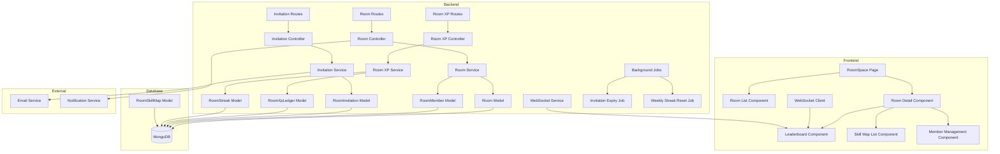

# Design Document: RoomSpace

## Overview

RoomSpace is a collaborative learning feature that enables users to create private rooms, invite friends, practice shared skill maps, and compete on XP-based leaderboards. The feature integrates seamlessly into the existing LearnLoop application as a new top-level navigation item.

### Key Design Principles

1. **Isolation**: Room XP, progress, and streaks are completely separate from global user profiles
2. **Real-time Collaboration**: WebSocket-based leaderboard updates provide near-instant feedback
3. **Scalability**: Designed to handle multiple rooms per user with efficient data structures
4. **Consistency**: Reuses existing patterns from skill maps, XP system, and UI components
5. **Data Integrity**: Soft deletes preserve audit trails while maintaining clean user experiences

### Feature Scope

- **Room Management**: Create, edit, delete rooms with ownership controls
- **Membership**: Invite users by email, accept/decline invitations, manage members
- **Skill Maps**: Add skill maps from templates or create new ones scoped to rooms
- **XP & Leaderboards**: Track room-specific XP with real-time leaderboard updates
- **Streaks**: Maintain consecutive day practice streaks with weekly resets
- **Notifications**: In-app and email notifications for room events

## Architecture

### System Components



### Technology Stack

- **Frontend**: React, React Router, Socket.IO Client, Tailwind CSS
- **Backend**: Node.js, Express, Socket.IO, Mongoose
- **Database**: MongoDB with Mongoose ODM
- **Real-time**: WebSocket (Socket.IO) for leaderboard updates
- **Background Jobs**: Node-cron for scheduled tasks
- **Notifications**: Existing notification system integration

### Data Flow

#### Room Creation Flow
1. User clicks "Create Room" → Frontend validates input
2. Frontend sends POST /api/rooms → Backend validates ownership limit
3. Backend creates room record → Creates room_members record with role "owner"
4. Backend returns room data → Frontend navigates to room detail page

#### Invitation Flow
1. Owner enters email → Frontend validates format
2. Frontend sends POST /api/rooms/:roomId/invitations → Backend validates user exists
3. Backend creates invitation record → Sends in-app + email notification
4. Invited user clicks accept → Frontend sends PATCH /api/invitations/:id/accept
5. Backend verifies room capacity → Adds to room_members → Updates invitation status
6. Backend sends notification to owner → Frontend updates room member list

#### XP Earning Flow
1. User completes node in room skill map → Frontend sends completion event
2. Backend calculates XP → Creates room_xp_ledger entry
3. Backend updates room_streaks if new day → Broadcasts WebSocket event
4. WebSocket updates leaderboard in real-time → All connected room members see update

## Components and Interfaces

### Backend Models

#### Room Model (`backend/src/models/Room.js`)

```javascript
import mongoose from 'mongoose';

const RoomSchema = new mongoose.Schema({
  ownerId: {
    type: String,
    required: true,
    index: true
  },
  name: {
    type: String,
    required: true,
    trim: true,
    minlength: 1,
    maxlength: 50
  },
  description: {
    type: String,
    default: '',
    maxlength: 200,
    trim: true
  },
  deletedAt: {
    type: Date,
    default: null
  }
}, {
  timestamps: true
});

// Indexes for efficient queries
RoomSchema.index({ ownerId: 1, deletedAt: 1 });
RoomSchema.index({ createdAt: -1 });

// Virtual for member count (populated separately)
RoomSchema.virtual('memberCount', {
  ref: 'RoomMember',
  localField: '_id',
  foreignField: 'roomId',
  count: true
});

export default mongoose.model('Room', RoomSchema);
```

#### RoomMember Model (`backend/src/models/RoomMember.js`)

```javascript
import mongoose from 'mongoose';

const RoomMemberSchema = new mongoose.Schema({
  roomId: {
    type: mongoose.Schema.Types.ObjectId,
    ref: 'Room',
    required: true,
    index: true
  },
  userId: {
    type: String,
    required: true,
    index: true
  },
  role: {
    type: String,
    enum: ['owner', 'member'],
    required: true
  },
  joinedAt: {
    type: Date,
    default: Date.now
  }
}, {
  timestamps: true
});

// Compound unique index to prevent duplicate memberships
RoomMemberSchema.index({ roomId: 1, userId: 1 }, { unique: true });

// Index for user's room list queries
RoomMemberSchema.index({ userId: 1, createdAt: -1 });

export default mongoose.model('RoomMember', RoomMemberSchema);
```

#### RoomInvitation Model (`backend/src/models/RoomInvitation.js`)

```javascript
import mongoose from 'mongoose';

const RoomInvitationSchema = new mongoose.Schema({
  roomId: {
    type: mongoose.Schema.Types.ObjectId,
    ref: 'Room',
    required: true,
    index: true
  },
  invitedBy: {
    type: String,
    required: true
  },
  invitedEmail: {
    type: String,
    required: true,
    lowercase: true,
    trim: true
  },
  invitedUserId: {
    type: String,
    default: null,
    index: true
  },
  status: {
    type: String,
    enum: ['pending', 'accepted', 'declined', 'expired'],
    default: 'pending',
    index: true
  },
  expiresAt: {
    type: Date,
    required: true,
    index: true
  }
}, {
  timestamps: true
});

// Compound indexes for efficient queries
RoomInvitationSchema.index({ roomId: 1, invitedEmail: 1, status: 1 });
RoomInvitationSchema.index({ invitedUserId: 1, status: 1 });
RoomInvitationSchema.index({ status: 1, expiresAt: 1 }); // For expiry job

export default mongoose.model('RoomInvitation', RoomInvitationSchema);
```

#### RoomSkillMap Model (`backend/src/models/RoomSkillMap.js`)

```javascript
import mongoose from 'mongoose';

const RoomSkillMapSchema = new mongoose.Schema({
  roomId: {
    type: mongoose.Schema.Types.ObjectId,
    ref: 'Room',
    required: true,
    index: true
  },
  skillMapId: {
    type: mongoose.Schema.Types.ObjectId,
    ref: 'Skill',
    required: true,
    index: true
  },
  addedBy: {
    type: String,
    required: true
  },
  createdAt: {
    type: Date,
    default: Date.now
  }
});

// Compound unique index to prevent duplicate skill maps in a room
RoomSkillMapSchema.index({ roomId: 1, skillMapId: 1 }, { unique: true });

export default mongoose.model('RoomSkillMap', RoomSkillMapSchema);
```

#### RoomXpLedger Model (`backend/src/models/RoomXpLedger.js`)

```javascript
import mongoose from 'mongoose';

const RoomXpLedgerSchema = new mongoose.Schema({
  roomId: {
    type: mongoose.Schema.Types.ObjectId,
    ref: 'Room',
    required: true,
    index: true
  },
  userId: {
    type: String,
    required: true,
    index: true
  },
  skillMapId: {
    type: mongoose.Schema.Types.ObjectId,
    ref: 'Skill',
    required: true
  },
  xpAmount: {
    type: Number,
    required: true,
    min: 0
  },
  earnedAt: {
    type: Date,
    default: Date.now,
    index: true
  }
});

// Compound indexes for efficient aggregation queries
RoomXpLedgerSchema.index({ roomId: 1, userId: 1, earnedAt: -1 });
RoomXpLedgerSchema.index({ roomId: 1, earnedAt: -1 });

export default mongoose.model('RoomXpLedger', RoomXpLedgerSchema);
```

#### RoomStreak Model (`backend/src/models/RoomStreak.js`)

```javascript
import mongoose from 'mongoose';

const RoomStreakSchema = new mongoose.Schema({
  roomId: {
    type: mongoose.Schema.Types.ObjectId,
    ref: 'Room',
    required: true,
    index: true
  },
  userId: {
    type: String,
    required: true,
    index: true
  },
  currentStreak: {
    type: Number,
    default: 0,
    min: 0
  },
  longestStreak: {
    type: Number,
    default: 0,
    min: 0
  },
  lastActivityDate: {
    type: Date,
    default: null
  },
  lastResetAt: {
    type: Date,
    default: null
  }
}, {
  timestamps: true
});

// Compound unique index
RoomStreakSchema.index({ roomId: 1, userId: 1 }, { unique: true });

export default mongoose.model('RoomStreak', RoomStreakSchema);
```

### Backend Services

#### RoomService (`backend/src/services/RoomService.js`)

**Key Methods:**
- `createRoom(userId, { name, description })` - Creates room with ownership validation
- `getRoomById(roomId, userId)` - Fetches room with membership verification
- `getUserRooms(userId)` - Returns all rooms where user is owner or member
- `updateRoom(roomId, userId, updates)` - Updates room details (owner only)
- `deleteRoom(roomId, userId)` - Soft deletes room and notifies members
- `getRoomMembers(roomId)` - Returns all active members with user details
- `kickMember(roomId, ownerId, targetUserId)` - Removes member (owner only)
- `leaveRoom(roomId, userId)` - Removes member (non-owners only)
- `addSkillMap(roomId, userId, skillMapId)` - Links skill map to room
- `removeSkillMap(roomId, userId, skillMapId)` - Unlinks skill map from room
- `getRoomSkillMaps(roomId)` - Returns all skill maps for a room

**Business Logic:**
- Enforces 3-room ownership limit per user
- Enforces 5-member capacity per room
- Validates ownership for privileged operations
- Handles soft deletes with audit trail preservation

#### InvitationService (`backend/src/services/InvitationService.js`)

**Key Methods:**
- `createInvitation(roomId, ownerId, invitedEmail)` - Creates invitation with validation
- `acceptInvitation(invitationId, userId)` - Accepts invitation and adds to room
- `declineInvitation(invitationId, userId)` - Declines invitation
- `getUserInvitations(userId)` - Returns pending invitations for user
- `getRoomInvitations(roomId)` - Returns all invitations for a room
- `expireInvitations()` - Background job to expire old invitations

**Business Logic:**
- Validates email matches registered user
- Prevents duplicate invitations (pending status check)
- Prevents self-invitation
- Prevents invitation to existing members
- Checks room capacity before acceptance
- Sets 7-day expiration on creation
- Sends notifications for all state changes

#### RoomXpService (`backend/src/services/RoomXpService.js`)

**Key Methods:**
- `awardXp(roomId, userId, skillMapId, xpAmount)` - Records XP transaction
- `getRoomLeaderboard(roomId)` - Returns sorted leaderboard with XP and streaks
- `getUserRoomXp(roomId, userId)` - Returns user's total XP in room
- `updateStreak(roomId, userId)` - Updates streak based on activity
- `resetWeeklyStreaks()` - Background job to reset all streaks on Monday 00:00 UTC

**Business Logic:**
- XP is completely isolated from global XP system
- Leaderboard sorting: XP desc → streak desc → username asc
- Streak increments on consecutive days, resets if gap > 1 day
- Weekly reset preserves longest_streak but zeros current_streak
- Real-time WebSocket broadcast on XP/streak changes

### Backend API Endpoints

#### Room Endpoints

```
POST   /api/rooms
GET    /api/rooms
GET    /api/rooms/:roomId
PATCH  /api/rooms/:roomId
DELETE /api/rooms/:roomId
GET    /api/rooms/:roomId/members
DELETE /api/rooms/:roomId/members/:userId
POST   /api/rooms/:roomId/leave
GET    /api/rooms/:roomId/skill-maps
POST   /api/rooms/:roomId/skill-maps
DELETE /api/rooms/:roomId/skill-maps/:skillMapId
```

#### Invitation Endpoints

```
POST   /api/rooms/:roomId/invitations
GET    /api/invitations
GET    /api/rooms/:roomId/invitations
PATCH  /api/invitations/:invitationId/accept
PATCH  /api/invitations/:invitationId/decline
```

#### Room XP & Leaderboard Endpoints

```
POST   /api/rooms/:roomId/xp
GET    /api/rooms/:roomId/leaderboard
GET    /api/rooms/:roomId/xp/:userId
```

### Frontend Components

#### RoomSpace Page (`frontend/src/pages/RoomSpace.jsx`)

**Responsibilities:**
- Displays list of user's rooms (owner + member)
- Shows empty state with "Create Room" CTA
- Provides "Create Room" button
- Navigates to room detail on click

**State:**
- `rooms` - Array of room objects
- `isLoading` - Loading state
- `error` - Error message

#### Room Detail Page (`frontend/src/pages/RoomDetail.jsx`)

**Responsibilities:**
- Displays room name, description, member count
- Shows leaderboard with real-time updates
- Lists skill maps with progress
- Provides owner controls (edit, delete, kick, invite, add skill maps)
- Provides member controls (leave room)

**State:**
- `room` - Room object
- `members` - Array of member objects
- `leaderboard` - Array of leaderboard entries
- `skillMaps` - Array of skill map objects
- `isOwner` - Boolean ownership flag

#### Leaderboard Component (`frontend/src/components/RoomLeaderboard.jsx`)

**Responsibilities:**
- Displays ranked list of members
- Shows avatar, username, XP, streak
- Highlights current user's row
- Connects to WebSocket for real-time updates

**Props:**
- `roomId` - Room identifier
- `currentUserId` - Current user's ID

**WebSocket Events:**
- Listens: `room_leaderboard_update`
- Emits: `join_room_leaderboard`

#### Invitation List Component (`frontend/src/components/InvitationList.jsx`)

**Responsibilities:**
- Displays pending invitations
- Shows room name, owner name, expiration
- Provides accept/decline buttons

**Props:**
- `invitations` - Array of invitation objects
- `onAccept` - Accept handler
- `onDecline` - Decline handler

### WebSocket Events

#### Room Leaderboard Events

```javascript
// Client → Server
socket.emit('join_room_leaderboard', { roomId });
socket.emit('leave_room_leaderboard', { roomId });

// Server → Client
socket.on('room_leaderboard_update', (data) => {
  // data: { roomId, leaderboard: [...], timestamp }
});

socket.on('room_xp_earned', (data) => {
  // data: { roomId, userId, xpAmount, newTotal, timestamp }
});

socket.on('room_streak_updated', (data) => {
  // data: { roomId, userId, currentStreak, timestamp }
});
```

## Data Models

### Room

```typescript
interface Room {
  _id: ObjectId;
  ownerId: string;
  name: string; // 1-50 chars
  description: string; // 0-200 chars
  createdAt: Date;
  updatedAt: Date;
  deletedAt: Date | null;
}
```

### RoomMember

```typescript
interface RoomMember {
  _id: ObjectId;
  roomId: ObjectId;
  userId: string;
  role: 'owner' | 'member';
  joinedAt: Date;
  createdAt: Date;
  updatedAt: Date;
}
```

### RoomInvitation

```typescript
interface RoomInvitation {
  _id: ObjectId;
  roomId: ObjectId;
  invitedBy: string;
  invitedEmail: string;
  invitedUserId: string | null;
  status: 'pending' | 'accepted' | 'declined' | 'expired';
  expiresAt: Date;
  createdAt: Date;
  updatedAt: Date;
}
```

### RoomSkillMap

```typescript
interface RoomSkillMap {
  _id: ObjectId;
  roomId: ObjectId;
  skillMapId: ObjectId;
  addedBy: string;
  createdAt: Date;
}
```

### RoomXpLedger

```typescript
interface RoomXpLedger {
  _id: ObjectId;
  roomId: ObjectId;
  userId: string;
  skillMapId: ObjectId;
  xpAmount: number; // positive integer
  earnedAt: Date;
}
```

### RoomStreak

```typescript
interface RoomStreak {
  _id: ObjectId;
  roomId: ObjectId;
  userId: string;
  currentStreak: number; // >= 0
  longestStreak: number; // >= 0
  lastActivityDate: Date | null;
  lastResetAt: Date | null;
  createdAt: Date;
  updatedAt: Date;
}
```

### Leaderboard Entry (Computed)

```typescript
interface LeaderboardEntry {
  rank: number;
  userId: string;
  username: string;
  avatar: string | null;
  totalXp: number;
  currentStreak: number;
  isCurrentUser: boolean;
}
```

## Error Handling

### Validation Errors

**Room Creation:**
- Empty name → 400 "Room name is required"
- Name > 50 chars → 400 "Room name must be 50 characters or less"
- Description > 200 chars → 400 "Description must be 200 characters or less"
- Ownership limit exceeded → 403 "You can only own up to 3 rooms"

**Invitations:**
- Invalid email format → 400 "Invalid email address"
- Email not registered → 404 "No account found with this email"
- Self-invitation → 400 "You cannot invite yourself"
- Duplicate invitation → 409 "Invitation already sent to this user"
- User already member → 409 "User is already a member"
- Room full → 403 "Room is full (5/5 members)"

**Member Management:**
- Non-owner kick attempt → 403 "Only room owners can remove members"
- Owner self-kick → 400 "Owners cannot kick themselves"
- Owner leave attempt → 400 "Owners cannot leave rooms. Delete the room instead."

### Race Conditions

**Concurrent Invitation Acceptance:**
- Use atomic MongoDB operations with `findOneAndUpdate`
- Check room capacity in same transaction as member addition
- Return 403 if capacity exceeded during acceptance

**Concurrent Room Creation:**
- Query ownership count and create room in service layer
- Accept potential race condition (user might create 4th room briefly)
- Background job can audit and flag violations

**Concurrent XP Awards:**
- Use MongoDB atomic increments for XP totals
- Ledger entries are append-only (no conflicts)
- Leaderboard recalculated from ledger on each query

### Network Failures

**WebSocket Disconnection:**
- Client automatically reconnects with exponential backoff
- Client re-joins room leaderboard channels on reconnect
- Fallback to polling every 30 seconds if WebSocket unavailable

**API Request Failures:**
- Frontend displays error toast with retry button
- Optimistic UI updates rolled back on failure
- Critical operations (room creation, invitation acceptance) show loading state

### Data Consistency

**Soft Deletes:**
- Rooms: Set `deletedAt`, exclude from queries with `deletedAt: null` filter
- Members: Remove from `room_members` table, retain XP/streak records
- Audit trail preserved for compliance and debugging

**Orphaned Records:**
- Background job periodically checks for orphaned invitations
- Expired invitations cleaned up by daily cron job
- XP ledger entries never deleted (append-only audit log)

## Testing Strategy

### Unit Tests

**Backend Services:**
- RoomService: Test ownership limits, capacity limits, validation
- InvitationService: Test duplicate prevention, expiration logic, state transitions
- RoomXpService: Test XP calculation, leaderboard sorting, streak logic

**Backend Models:**
- Test schema validation (field lengths, required fields, enums)
- Test unique constraints (room_id + user_id combinations)
- Test indexes are created correctly

**Frontend Components:**
- Test empty states render correctly
- Test owner vs member UI differences
- Test confirmation dialogs appear for destructive actions

### Integration Tests

**API Endpoints:**
- Test full room creation flow (POST /api/rooms → GET /api/rooms/:id)
- Test invitation flow (create → accept → verify membership)
- Test XP earning flow (award XP → verify ledger → check leaderboard)

**WebSocket:**
- Test connection/disconnection handling
- Test room join/leave events
- Test leaderboard update broadcasts

**Background Jobs:**
- Test invitation expiry job marks expired invitations
- Test weekly streak reset job zeros current_streak
- Test jobs handle errors gracefully

### End-to-End Tests

**Critical User Flows:**
1. Create room → Invite user → Accept invitation → View leaderboard
2. Practice skill map → Earn XP → See leaderboard update in real-time
3. Owner kicks member → Member receives notification → Room removed from member's list
4. Owner deletes room → All members notified → Room removed from all lists

**Edge Cases:**
- Attempt to create 4th room (should fail)
- Attempt to accept invitation to full room (should fail)
- Attempt to invite non-existent email (should fail)
- WebSocket disconnection during XP award (should reconnect and update)

### Performance Tests

**Leaderboard Queries:**
- Test query performance with 5 members (max capacity)
- Test aggregation performance with 100+ XP transactions per user
- Verify indexes are used (explain plan analysis)

**WebSocket Scalability:**
- Test 100 concurrent connections to same room
- Test broadcast latency (should be < 100ms)
- Test reconnection storm (many clients reconnecting simultaneously)

## Implementation Notes

### Phase 1: Core Infrastructure
1. Create database models and migrations
2. Implement RoomService with CRUD operations
3. Implement API endpoints for rooms
4. Create basic frontend pages (RoomSpace, RoomDetail)

### Phase 2: Invitations
1. Implement InvitationService
2. Create invitation API endpoints
3. Integrate with notification system
4. Build invitation UI components

### Phase 3: Skill Maps & XP
1. Implement RoomXpService
2. Create XP/leaderboard API endpoints
3. Integrate with existing skill map practice flow
4. Build leaderboard component

### Phase 4: Real-time Updates
1. Extend WebSocketService for room events
2. Implement leaderboard broadcast logic
3. Add WebSocket client to frontend
4. Test real-time synchronization

### Phase 5: Background Jobs
1. Implement invitation expiry cron job
2. Implement weekly streak reset cron job
3. Add job monitoring and error handling
4. Test job execution and recovery

### Phase 6: Polish & Testing
1. Add confirmation dialogs for destructive actions
2. Implement error handling and user feedback
3. Write comprehensive test suite
4. Performance optimization and load testing

### Migration Strategy

**Database:**
- No existing data to migrate (new feature)
- Create indexes on deployment
- Seed test data for development

**Frontend:**
- Add "RoomSpace" link to Sidebar navigation
- Reuse existing components (Button, Input, Modal, etc.)
- Follow existing routing patterns

**Backend:**
- Add new routes to Express app
- Extend WebSocketService with room events
- Add cron jobs to server startup

### Security Considerations

**Authorization:**
- Verify room ownership for privileged operations (edit, delete, kick, invite)
- Verify room membership for viewing room details
- Verify invitation recipient for accept/decline actions

**Input Validation:**
- Sanitize room name and description (prevent XSS)
- Validate email format before lookup
- Validate ObjectId format for all ID parameters

**Rate Limiting:**
- Limit room creation to 3 per user (enforced in service layer)
- Limit invitation sending to prevent spam (10 per hour per user)
- Limit XP award requests to prevent abuse (validated against actual node completions)

**Data Privacy:**
- Only show email addresses to room owners (for invitation management)
- Hide deleted rooms from all queries
- Retain audit logs but exclude from user-facing APIs

## Appendix

### Database Indexes

```javascript
// Room
{ ownerId: 1, deletedAt: 1 }
{ createdAt: -1 }

// RoomMember
{ roomId: 1, userId: 1 } // unique
{ userId: 1, createdAt: -1 }
{ roomId: 1 }

// RoomInvitation
{ roomId: 1, invitedEmail: 1, status: 1 }
{ invitedUserId: 1, status: 1 }
{ status: 1, expiresAt: 1 }
{ roomId: 1 }

// RoomSkillMap
{ roomId: 1, skillMapId: 1 } // unique
{ roomId: 1 }
{ skillMapId: 1 }

// RoomXpLedger
{ roomId: 1, userId: 1, earnedAt: -1 }
{ roomId: 1, earnedAt: -1 }
{ roomId: 1 }
{ userId: 1 }

// RoomStreak
{ roomId: 1, userId: 1 } // unique
{ roomId: 1 }
{ userId: 1 }
```

### API Request/Response Examples

#### Create Room

**Request:**
```http
POST /api/rooms
Content-Type: application/json
Authorization: Bearer <token>

{
  "name": "JavaScript Study Group",
  "description": "Learning JS together"
}
```

**Response:**
```http
HTTP/1.1 201 Created
Content-Type: application/json

{
  "success": true,
  "data": {
    "room": {
      "_id": "507f1f77bcf86cd799439011",
      "ownerId": "user123",
      "name": "JavaScript Study Group",
      "description": "Learning JS together",
      "createdAt": "2024-01-15T10:30:00.000Z",
      "updatedAt": "2024-01-15T10:30:00.000Z",
      "deletedAt": null
    }
  }
}
```

#### Get Room Leaderboard

**Request:**
```http
GET /api/rooms/507f1f77bcf86cd799439011/leaderboard
Authorization: Bearer <token>
```

**Response:**
```http
HTTP/1.1 200 OK
Content-Type: application/json

{
  "success": true,
  "data": {
    "leaderboard": [
      {
        "rank": 1,
        "userId": "user123",
        "username": "Alice",
        "avatar": "https://...",
        "totalXp": 450,
        "currentStreak": 5,
        "isCurrentUser": true
      },
      {
        "rank": 2,
        "userId": "user456",
        "username": "Bob",
        "avatar": null,
        "totalXp": 380,
        "currentStreak": 3,
        "isCurrentUser": false
      }
    ],
    "roomId": "507f1f77bcf86cd799439011",
    "timestamp": "2024-01-15T10:30:00.000Z"
  }
}
```

### Cron Job Schedules

```javascript
// Invitation Expiry Job
// Runs daily at 00:00 UTC
cron.schedule('0 0 * * *', async () => {
  await InvitationService.expireInvitations();
});

// Weekly Streak Reset Job
// Runs every Monday at 00:00 UTC
cron.schedule('0 0 * * 1', async () => {
  await RoomXpService.resetWeeklyStreaks();
});
```

### UI Component Hierarchy

```
RoomSpace Page
├── Sidebar (existing)
├── RoomList Component
│   ├── EmptyState (if no rooms)
│   └── RoomCard Component (for each room)
│       ├── Room name
│       ├── Member count
│       └── Role badge (owner/member)
└── CreateRoomModal Component
    ├── Input (name)
    ├── Textarea (description)
    └── Button (submit)

RoomDetail Page
├── Sidebar (existing)
├── RoomHeader Component
│   ├── Room name
│   ├── Room description
│   ├── Member count
│   └── Owner controls (if owner)
│       ├── Edit button
│       ├── Delete button
│       └── Invite button
├── RoomLeaderboard Component
│   └── LeaderboardRow Component (for each member)
│       ├── Rank
│       ├── Avatar
│       ├── Username
│       ├── XP total
│       └── Streak count
├── RoomSkillMapList Component
│   ├── AddSkillMapButton (if owner)
│   └── SkillMapCard Component (for each skill map)
│       ├── Skill map name
│       ├── Progress bar
│       └── Remove button (if owner)
└── RoomMemberList Component
    └── MemberCard Component (for each member)
        ├── Avatar
        ├── Username
        ├── Role badge
        └── Kick button (if owner, not self)
```
