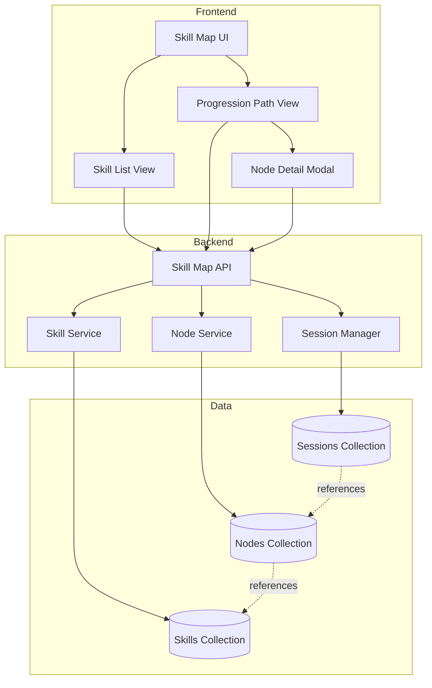
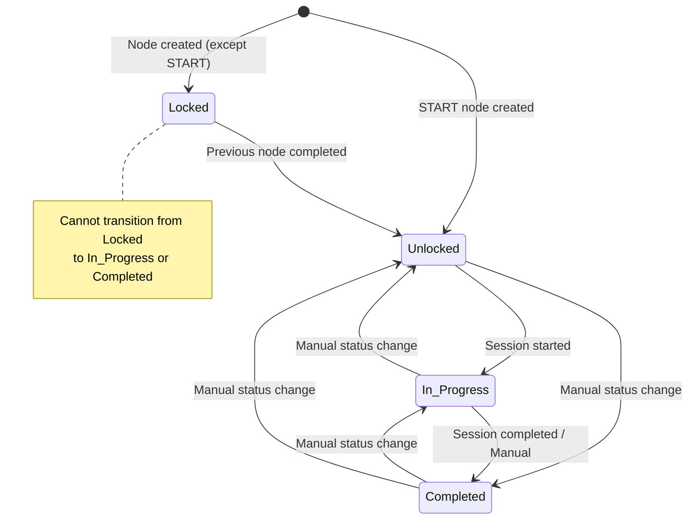
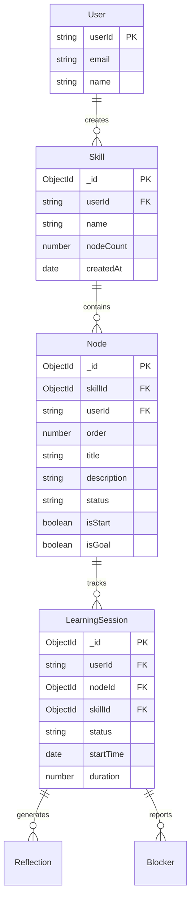

                                                                                                                                            # Design Document: Skill Map Progression

## Overview

The Skill Map Progression feature is a gamified learning system that enables users to structure their learning journey through visual skill maps. Each skill contains 2-16 sequential nodes arranged in a zig-zag progression path from START to GOAL. Nodes unlock sequentially as learners complete previous steps, integrating with existing practice sessions, reflections, and blockers to provide a cohesive learning experience.

### Key Design Principles

1. **Sequential Progression**: Nodes unlock one at a time, maintaining a clear learning path
2. **Visual Clarity**: Zig-zag layout provides intuitive understanding of progress
3. **Integration First**: Leverage existing Session Manager, Reflection, and Blocker systems
4. **Mobile-First Responsive**: Touch-friendly interface that works across all devices
5. **Real-Time Feedback**: Immediate visual updates on status changes

### System Context

The Skill Map system integrates with:
- **Session Manager**: Handles timed practice sessions linked to nodes
- **Reflection System**: Captures learning insights after sessions
- **Blocker System**: Tracks obstacles encountered during learning
- **MongoDB**: Persists skill and node data with referential integrity

## Architecture

### High-Level Architecture



### Component Responsibilities

**Frontend Components**:
- `SkillMapPage`: Main container managing routing between list and path views
- `SkillList`: Displays all skills with progress indicators
- `ProgressionPath`: Renders zig-zag node visualization
- `NodeCard`: Individual node display with status indicators
- `NodeDetailModal`: Shows node details, sessions, reflections, blockers
- `SessionCompletionPrompt`: Post-session workflow for reflections/blockers

**Backend Services**:
- `SkillService`: CRUD operations for skills, progress calculations
- `NodeService`: Node management, status transitions, validation
- `SessionLinkingService`: Links sessions to nodes, manages relationships

**API Routes**:
- `POST /api/skills`: Create new skill with nodes
- `GET /api/skills`: List all user skills
- `GET /api/skills/:id`: Get skill with all nodes
- `DELETE /api/skills/:id`: Delete skill and cascade
- `PATCH /api/nodes/:id`: Update node content or status
- `DELETE /api/nodes/:id`: Delete node (with validation)
- `POST /api/nodes/:id/sessions`: Start session for node
- `GET /api/nodes/:id/details`: Get node with linked content

## Components and Interfaces

### Data Models

#### Skill Model
```javascript
{
  _id: ObjectId,
  userId: String,              // Firebase UID
  name: String,                // 1-100 characters
  nodeCount: Number,           // 2-16 inclusive
  createdAt: Date,
  updatedAt: Date
}
```

**Indexes**:
- `{ userId: 1, createdAt: -1 }`: User skill list queries
- `{ userId: 1, name: 1 }`: Duplicate name checks

**Validation**:
- `name`: Required, 1-100 characters, trimmed
- `nodeCount`: Required, integer 2-16 inclusive
- `userId`: Required, indexed for multi-tenancy

#### Node Model
```javascript
{
  _id: ObjectId,
  skillId: ObjectId,           // Reference to Skill
  userId: String,              // Denormalized for query efficiency
  order: Number,               // 1 to N (sequential)
  title: String,               // Max 200 characters
  description: String,         // Max 2000 characters
  status: String,              // 'Locked' | 'Unlocked' | 'In_Progress' | 'Completed'
  isStart: Boolean,            // True for first node
  isGoal: Boolean,             // True for last node
  createdAt: Date,
  updatedAt: Date
}
```

**Indexes**:
- `{ skillId: 1, order: 1 }`: Ordered node retrieval
- `{ userId: 1, status: 1 }`: User progress queries
- `{ skillId: 1, userId: 1 }`: Compound query optimization

**Validation**:
- `status`: Enum validation, default 'Locked'
- `order`: Positive integer, unique within skill
- `title`: Max 200 characters
- `description`: Max 2000 characters

#### Extended LearningSession Model
The existing `LearningSession` model will be extended with:
```javascript
{
  // Existing fields...
  nodeId: ObjectId,            // Reference to Node (already exists)
  skillId: ObjectId,           // Reference to Skill (already exists)
  // ... rest of existing schema
}
```

### API Interfaces

#### Create Skill
```
POST /api/skills
Authorization: Bearer <token>

Request:
{
  "name": "Learn React Hooks",
  "nodeCount": 8
}

Response: 201 Created
{
  "skill": {
    "_id": "...",
    "name": "Learn React Hooks",
    "nodeCount": 8,
    "createdAt": "2024-01-15T10:00:00Z"
  },
  "nodes": [
    {
      "_id": "...",
      "order": 1,
      "title": "Node 1",
      "status": "Unlocked",
      "isStart": true
    },
    // ... 6 more nodes with status "Locked"
    {
      "_id": "...",
      "order": 8,
      "title": "Node 8",
      "status": "Locked",
      "isGoal": true
    }
  ]
}
```

#### Get Skill List
```
GET /api/skills
Authorization: Bearer <token>

Response: 200 OK
{
  "skills": [
    {
      "_id": "...",
      "name": "Learn React Hooks",
      "nodeCount": 8,
      "completedNodes": 3,
      "completionPercentage": 37.5,
      "createdAt": "2024-01-15T10:00:00Z"
    }
  ]
}
```

#### Get Progression Path
```
GET /api/skills/:skillId/nodes
Authorization: Bearer <token>

Response: 200 OK
{
  "skill": {
    "_id": "...",
    "name": "Learn React Hooks",
    "completionPercentage": 37.5
  },
  "nodes": [
    {
      "_id": "...",
      "order": 1,
      "title": "useState Basics",
      "description": "Learn the fundamentals...",
      "status": "Completed",
      "isStart": true
    },
    // ... more nodes
  ]
}
```

#### Update Node Status
```
PATCH /api/nodes/:nodeId/status
Authorization: Bearer <token>

Request:
{
  "status": "Completed"
}

Response: 200 OK
{
  "node": {
    "_id": "...",
    "status": "Completed",
    "updatedAt": "2024-01-15T11:00:00Z"
  },
  "nextNode": {
    "_id": "...",
    "status": "Unlocked"  // Auto-unlocked
  }
}
```

#### Start Session from Node
```
POST /api/nodes/:nodeId/sessions
Authorization: Bearer <token>

Response: 201 Created
{
  "sessionId": "...",
  "nodeId": "...",
  "startTime": "2024-01-15T11:00:00Z",
  "status": "active",
  "nodeStatusUpdated": true  // If changed from Unlocked to In_Progress
}
```

#### Get Node Details
```
GET /api/nodes/:nodeId/details
Authorization: Bearer <token>

Response: 200 OK
{
  "node": {
    "_id": "...",
    "title": "useState Basics",
    "description": "...",
    "status": "Completed",
    "order": 1
  },
  "sessions": [
    {
      "_id": "...",
      "duration": 1800,
      "date": "2024-01-15T10:00:00Z",
      "status": "completed"
    }
  ],
  "reflections": [
    {
      "_id": "...",
      "content": "Great learning session...",
      "mood": "Happy",
      "createdAt": "2024-01-15T10:30:00Z"
    }
  ],
  "blockers": []
}
```

### Frontend State Management

#### Skill Map Context
```javascript
const SkillMapContext = {
  skills: [],
  currentSkill: null,
  nodes: [],
  isLoading: boolean,
  error: string | null,
  
  // Actions
  createSkill: (name, nodeCount) => Promise<Skill>,
  deleteSkill: (skillId) => Promise<void>,
  loadSkills: () => Promise<void>,
  loadSkillNodes: (skillId) => Promise<void>,
  updateNodeStatus: (nodeId, status) => Promise<void>,
  updateNodeContent: (nodeId, { title, description }) => Promise<void>,
  deleteNode: (nodeId) => Promise<void>,
  startSession: (nodeId) => Promise<Session>
}
```

### Service Layer Architecture

#### SkillService
```javascript
class SkillService {
  async createSkill(userId, name, nodeCount) {
    // 1. Validate inputs
    // 2. Create skill document
    // 3. Generate nodes (1 to nodeCount)
    // 4. Set first node to Unlocked, rest to Locked
    // 5. Mark first as START, last as GOAL
    // 6. Save in transaction
    // 7. Return skill with nodes
  }
  
  async getUserSkills(userId) {
    // 1. Query skills by userId
    // 2. For each skill, aggregate node completion
    // 3. Calculate completion percentage
    // 4. Sort by createdAt desc
    // 5. Return enriched skill list
  }
  
  async deleteSkill(skillId, userId) {
    // 1. Verify ownership
    // 2. Delete all nodes (cascade)
    // 3. Unlink sessions (set nodeId to null)
    // 4. Delete skill
    // 5. Return success
  }
}
```

#### NodeService
```javascript
class NodeService {
  async updateNodeStatus(nodeId, newStatus, userId) {
    // 1. Verify ownership and current status
    // 2. Validate status transition
    // 3. Update node status
    // 4. If status = Completed, unlock next node
    // 5. If next is GOAL, check all others completed
    // 6. Return updated node(s)
  }
  
  async getNodeDetails(nodeId, userId) {
    // 1. Fetch node
    // 2. Query sessions where nodeId matches
    // 3. Query reflections linked to those sessions
    // 4. Query blockers linked to those sessions
    // 5. Return aggregated data
  }
  
  async deleteNode(nodeId, userId) {
    // 1. Verify ownership
    // 2. Check if START or GOAL (prevent)
    // 3. Check session count (prevent if > 0)
    // 4. Check remaining nodes >= 2 after delete
    // 5. Delete node
    // 6. Recalculate order numbers
    // 7. Update skill nodeCount
    // 8. Return success
  }
}
```

## Data Models

### Skill Schema (Mongoose)
```javascript
const SkillSchema = new mongoose.Schema({
  userId: {
    type: String,
    required: true,
    index: true
  },
  name: {
    type: String,
    required: true,
    trim: true,
    minlength: 1,
    maxlength: 100
  },
  nodeCount: {
    type: Number,
    required: true,
    min: 2,
    max: 16
  }
}, {
  timestamps: true
});

SkillSchema.index({ userId: 1, createdAt: -1 });
SkillSchema.index({ userId: 1, name: 1 });
```

### Node Schema (Mongoose)
```javascript
const NodeSchema = new mongoose.Schema({
  skillId: {
    type: mongoose.Schema.Types.ObjectId,
    ref: 'Skill',
    required: true,
    index: true
  },
  userId: {
    type: String,
    required: true,
    index: true
  },
  order: {
    type: Number,
    required: true,
    min: 1
  },
  title: {
    type: String,
    default: '',
    maxlength: 200,
    trim: true
  },
  description: {
    type: String,
    default: '',
    maxlength: 2000,
    trim: true
  },
  status: {
    type: String,
    enum: ['Locked', 'Unlocked', 'In_Progress', 'Completed'],
    default: 'Locked'
  },
  isStart: {
    type: Boolean,
    default: false
  },
  isGoal: {
    type: Boolean,
    default: false
  }
}, {
  timestamps: true
});

NodeSchema.index({ skillId: 1, order: 1 });
NodeSchema.index({ userId: 1, status: 1 });
NodeSchema.index({ skillId: 1, userId: 1 });

// Ensure unique order within skill
NodeSchema.index({ skillId: 1, order: 1 }, { unique: true });
```

### Status Transition Rules



### Database Relationships




## Correctness Properties

*A property is a characteristic or behavior that should hold true across all valid executions of a system—essentially, a formal statement about what the system should do. Properties serve as the bridge between human-readable specifications and machine-verifiable correctness guarantees.*

### Property Reflection

After analyzing all acceptance criteria, I identified several areas of redundancy:

1. **Input validation properties** (1.1, 1.2, 1.9, 1.10) can be consolidated into comprehensive validation properties
2. **Node detail modal display properties** (8.1-8.4) can be combined into a single comprehensive property
3. **Status transition properties** (5.5-5.8) overlap with the state machine validation
4. **Real-time update properties** (13.1-13.5) all test the same performance characteristic
5. **Integration properties** (15.1-15.3) test the same pattern of API usage
6. **Referential integrity properties** (14.2, 14.3) can be combined

The following properties represent the unique, non-redundant validation requirements:

### Property 1: Skill Name Validation

*For any* string input as a skill name, the system should accept strings with length 1-100 characters and reject strings with length 0 or >100 characters with an appropriate error message.

**Validates: Requirements 1.1, 1.9**

### Property 2: Node Count Validation

*For any* integer input as a node count, the system should accept integers in the range [2, 16] and reject integers outside this range with an appropriate error message.

**Validates: Requirements 1.2, 1.10**

### Property 3: Exact Node Generation

*For any* valid node count N, creating a skill should generate exactly N nodes in the database.

**Validates: Requirements 1.3**

### Property 4: START Node Initialization

*For any* skill created, the first node (order=1) should have isStart=true and status='Unlocked'.

**Validates: Requirements 1.4**

### Property 5: GOAL Node Initialization

*For any* skill created, the last node (order=nodeCount) should have isGoal=true and status='Locked'.

**Validates: Requirements 1.5**

### Property 6: Middle Nodes Initialization

*For any* skill created with more than 2 nodes, all nodes except the first should have status='Locked' initially.

**Validates: Requirements 1.6**

### Property 7: Sequential Order Assignment

*For any* skill created with N nodes, the nodes should have order values forming a complete sequence from 1 to N without gaps.

**Validates: Requirements 1.7**

### Property 8: Skill Creation Persistence Round-Trip

*For any* valid skill creation request, querying the database immediately after creation should return the skill with all generated nodes matching the creation parameters.

**Validates: Requirements 1.8**

### Property 9: User Data Isolation

*For any* authenticated user, the skill list should only contain skills where userId matches the authenticated user's ID.

**Validates: Requirements 2.1**

### Property 10: Completion Progress Calculation

*For any* skill, the completion count should equal the number of nodes with status='Completed', and the completion percentage should equal (completedNodes / totalNodes) * 100.

**Validates: Requirements 2.3, 2.4**

### Property 11: Skill List Ordering

*For any* list of skills returned, they should be ordered by createdAt in descending order (newest first).

**Validates: Requirements 2.6**

### Property 12: Skill Deletion Cascade

*For any* skill deleted, all associated nodes should be removed from the database, and querying for those nodes should return empty results.

**Validates: Requirements 3.2, 3.3**

### Property 13: Session Link Removal on Skill Deletion

*For any* skill with linked sessions, after skill deletion, those sessions should still exist but have nodeId set to null or removed.

**Validates: Requirements 3.4, 3.5**

### Property 14: Node Display Ordering

*For any* skill's progression path view, the displayed nodes should be ordered by the order field in ascending sequence.

**Validates: Requirements 4.1**

### Property 15: Zig-Zag Layout Pattern

*For any* progression path with N nodes, odd-ordered nodes should be positioned on one side and even-ordered nodes on the opposite side, creating an alternating pattern.

**Validates: Requirements 4.2**

### Property 16: Status Icon Rendering

*For any* node with status='Locked', the rendered output should contain a lock icon element; for any node with status='Completed', the rendered output should contain a checkmark icon element.

**Validates: Requirements 4.4, 4.5**

### Property 17: START and GOAL Label Display

*For any* skill, the first node should display a "START" label and the last node should display a "GOAL" label in the rendered output.

**Validates: Requirements 4.6, 4.7**

### Property 18: Progress Bar Accuracy

*For any* skill displayed in progression path view, the progress bar percentage should match the calculated completion percentage from node statuses.

**Validates: Requirements 4.8**

### Property 19: Node Completion Triggers Next Unlock

*For any* node marked as Completed, if the next node (order+1) exists and has status='Locked', that next node should transition to status='Unlocked'.

**Validates: Requirements 5.1, 5.2, 5.3**

### Property 20: Status Transition Validation

*For any* node, status transitions should follow the valid state machine: Locked can only transition to Unlocked; Unlocked can transition to In_Progress or Completed; In_Progress can transition to Unlocked or Completed; Completed can transition to Unlocked or In_Progress. Invalid transitions should be rejected.

**Validates: Requirements 5.5, 5.6, 5.7, 5.8**

### Property 21: Skill Progress Update on Node Status Change

*For any* node status change, the parent skill's completion percentage should be recalculated and updated to reflect the new node statuses.

**Validates: Requirements 5.9**

### Property 22: Session Button Visibility

*For any* node with status='Unlocked' or status='In_Progress', a "Start Practice Session" button should be present in the rendered output; for any node with status='Locked' or status='Completed', the button should not be present.

**Validates: Requirements 6.1, 6.5**

### Property 23: Session Creation Links to Node

*For any* session started from a node, the created session document should have nodeId field set to that node's ID.

**Validates: Requirements 6.2, 6.3, 15.4**

### Property 24: Session Start Updates Node Status

*For any* node with status='Unlocked', starting a practice session should change the node status to 'In_Progress'.

**Validates: Requirements 6.4**

### Property 25: Reflection and Blocker Node Linking

*For any* reflection or blocker created during session completion, the document should have both sessionId and nodeId fields set correctly.

**Validates: Requirements 7.5, 7.6, 15.5, 15.6**

### Property 26: Node Detail Modal Content Completeness

*For any* node detail modal rendered, it should display the node title, description, status, order number, and lists of all linked sessions, reflections, and blockers.

**Validates: Requirements 8.1, 8.2, 8.3, 8.4, 8.5, 8.7, 8.8**

### Property 27: Session Display Information

*For any* session displayed in the node detail modal, the rendered output should contain the session duration and date.

**Validates: Requirements 8.6**

### Property 28: Node Title Validation

*For any* node edit operation, title strings with length 0-200 characters should be accepted, and strings with length >200 characters should be rejected with an error message.

**Validates: Requirements 9.2, 9.6**

### Property 29: Node Description Validation

*For any* node edit operation, description strings with length 0-2000 characters should be accepted, and strings with length >2000 characters should be rejected with an error message.

**Validates: Requirements 9.3, 9.7**

### Property 30: Node Edit Persistence Round-Trip

*For any* valid node edit operation, querying the database immediately after the edit should return the node with the updated title and description values.

**Validates: Requirements 9.4**

### Property 31: Locked Node Edit Prevention

*For any* node with status='Locked', attempting to edit the title or description should be rejected.

**Validates: Requirements 9.5**

### Property 32: Status Change Options by Current Status

*For any* node with status='Unlocked', the UI should provide options to change to 'In_Progress' or 'Completed'; for status='In_Progress', options should be 'Unlocked' or 'Completed'; for status='Completed', options should be 'Unlocked' or 'In_Progress'.

**Validates: Requirements 10.1, 10.2, 10.3**

### Property 33: Locked Node Manual Status Change Prevention

*For any* node with status='Locked', attempting manual status changes should be rejected.

**Validates: Requirements 10.5**

### Property 34: Node Deletion with Zero Sessions

*For any* node with zero linked sessions (excluding START and GOAL nodes, and ensuring ≥2 nodes remain), deletion should succeed and the node should be removed from the database.

**Validates: Requirements 11.2**

### Property 35: Order Recalculation After Node Deletion

*For any* skill after a node deletion, the remaining nodes should have order values forming a complete sequence from 1 to N without gaps, where N is the new node count.

**Validates: Requirements 11.3**

### Property 36: Node Count Update After Deletion

*For any* skill after a node deletion, the skill's nodeCount field should equal the number of remaining nodes.

**Validates: Requirements 11.4**

### Property 37: Node Deletion Prevention with Sessions

*For any* node with one or more linked sessions, attempting deletion should be rejected with an error message.

**Validates: Requirements 11.5**

### Property 38: START and GOAL Node Deletion Prevention

*For any* node with isStart=true or isGoal=true, attempting deletion should be rejected.

**Validates: Requirements 11.6**

### Property 39: Minimum Node Count Enforcement

*For any* skill with exactly 2 nodes, attempting to delete either node should be rejected with an error message.

**Validates: Requirements 11.7**

### Property 40: Touch Target Size Compliance

*For any* interactive element in the skill map UI on mobile devices, the computed size should be at least 44x44 pixels.

**Validates: Requirements 12.4**

### Property 41: Real-Time Update Performance

*For any* node status change, session link, or progress update, the visual display should reflect the change within 500 milliseconds.

**Validates: Requirements 13.1, 13.2, 13.3, 13.4, 13.5**

### Property 42: Database Write Performance

*For any* skill or node data change, the data should be persisted to MongoDB within 1000 milliseconds.

**Validates: Requirements 14.1**

### Property 43: Referential Integrity Maintenance

*For any* node in the database, the skillId should reference an existing skill; for any session with a non-null nodeId, that node should exist or the nodeId should be null if the node was deleted.

**Validates: Requirements 14.2, 14.3**

### Property 44: Database Failure Error Logging

*For any* database write operation failure, an error log entry should be created containing the error message, timestamp, and user context.

**Validates: Requirements 14.5**

### Property 45: Application State Persistence Round-Trip

*For any* skill map state, after making changes and reloading the application, the displayed state should match the most recent database state.

**Validates: Requirements 14.6**

### Property 46: Session Manager Integration

*For any* session started from a node, the system should invoke SessionManager.startSession with the correct nodeId parameter.

**Validates: Requirements 15.1**

### Property 47: Content Retrieval by Node ID

*For any* node ID, querying for sessions, reflections, and blockers using that nodeId should return all content linked to that node.

**Validates: Requirements 15.7**

## Error Handling

### Error Categories

1. **Validation Errors**: Input validation failures (string length, numeric ranges)
2. **State Transition Errors**: Invalid status transitions, locked node operations
3. **Referential Integrity Errors**: Missing references, orphaned data
4. **Permission Errors**: User attempting to access/modify another user's data
5. **Database Errors**: Connection failures, write failures, query timeouts
6. **Integration Errors**: Session Manager, Reflection, or Blocker API failures

### Error Handling Strategy

#### Frontend Error Handling

```javascript
// Validation errors: Display inline with form fields
try {
  await createSkill(name, nodeCount);
} catch (error) {
  if (error.type === 'VALIDATION_ERROR') {
    setFieldError(error.field, error.message);
  }
}

// State transition errors: Display toast notification
try {
  await updateNodeStatus(nodeId, 'Completed');
} catch (error) {
  if (error.type === 'INVALID_TRANSITION') {
    showToast('error', error.message);
  }
}

// Database errors: Display error banner with retry option
try {
  await loadSkills();
} catch (error) {
  if (error.type === 'DATABASE_ERROR') {
    setError({
      message: 'Failed to load skills',
      retry: () => loadSkills()
    });
  }
}
```

#### Backend Error Handling

```javascript
// Validation middleware
const validateSkillCreation = (req, res, next) => {
  const { name, nodeCount } = req.body;
  
  if (!name || name.length < 1 || name.length > 100) {
    return res.status(400).json({
      type: 'VALIDATION_ERROR',
      field: 'name',
      message: 'Skill name must be 1-100 characters'
    });
  }
  
  if (!nodeCount || nodeCount < 2 || nodeCount > 16) {
    return res.status(400).json({
      type: 'VALIDATION_ERROR',
      field: 'nodeCount',
      message: 'Node count must be between 2 and 16'
    });
  }
  
  next();
};

// Service layer error handling
class NodeService {
  async updateNodeStatus(nodeId, newStatus, userId) {
    try {
      const node = await Node.findOne({ _id: nodeId, userId });
      
      if (!node) {
        throw new NotFoundError('Node not found');
      }
      
      if (!this.isValidTransition(node.status, newStatus)) {
        throw new InvalidTransitionError(
          `Cannot transition from ${node.status} to ${newStatus}`
        );
      }
      
      // Update logic...
      
    } catch (error) {
      logger.error('Node status update failed', {
        nodeId,
        userId,
        error: error.message,
        timestamp: new Date()
      });
      throw error;
    }
  }
}
```

### Error Response Format

All API errors follow a consistent format:

```json
{
  "type": "ERROR_TYPE",
  "message": "Human-readable error message",
  "field": "fieldName",  // Optional, for validation errors
  "code": "ERROR_CODE",  // Optional, for specific error codes
  "timestamp": "2024-01-15T10:00:00Z"
}
```

### Logging Strategy

- **Info**: Successful operations (skill created, node updated)
- **Warning**: Recoverable errors (validation failures, invalid transitions)
- **Error**: System errors (database failures, integration failures)
- **Critical**: Data integrity issues (referential integrity violations)

All logs include:
- Timestamp
- User ID
- Operation attempted
- Error details (if applicable)
- Request context

## Testing Strategy

### Dual Testing Approach

The Skill Map Progression feature requires both unit tests and property-based tests for comprehensive coverage:

**Unit Tests**: Focus on specific examples, edge cases, and integration points
- Specific skill creation scenarios (2 nodes, 16 nodes)
- UI component rendering with specific data
- Error handling for specific failure cases
- Integration with Session Manager, Reflection, and Blocker APIs

**Property-Based Tests**: Verify universal properties across all inputs
- Input validation across random string lengths and numeric ranges
- Node generation and ordering for random node counts
- Status transitions for random node states
- Data persistence round-trips for random skill/node data

### Property-Based Testing Configuration

**Library**: Use `fast-check` for JavaScript/TypeScript property-based testing

**Configuration**:
- Minimum 100 iterations per property test
- Each test tagged with feature name and property number
- Tag format: `Feature: skill-map-progression, Property {N}: {property_text}`

**Example Property Test**:
```javascript
import fc from 'fast-check';

describe('Feature: skill-map-progression, Property 1: Skill Name Validation', () => {
  it('should accept names 1-100 chars and reject others', () => {
    fc.assert(
      fc.property(
        fc.string({ minLength: 1, maxLength: 100 }),
        async (validName) => {
          const result = await createSkill(validName, 5);
          expect(result.success).toBe(true);
        }
      ),
      { numRuns: 100 }
    );
    
    fc.assert(
      fc.property(
        fc.string({ minLength: 101 }),
        async (invalidName) => {
          await expect(createSkill(invalidName, 5))
            .rejects
            .toThrow('Skill name must be 1-100 characters');
        }
      ),
      { numRuns: 100 }
    );
  });
});
```

### Test Coverage Requirements

**Backend**:
- Unit tests: 80% code coverage minimum
- Property tests: All 47 correctness properties implemented
- Integration tests: Session Manager, Reflection, Blocker API integration
- E2E tests: Complete skill creation → session → completion workflow

**Frontend**:
- Component tests: All UI components with React Testing Library
- Property tests: Rendering properties, validation properties
- Integration tests: API communication, state management
- Visual regression tests: Zig-zag layout, responsive design

### Testing Priorities

1. **Critical Path**: Skill creation, node unlocking, session linking
2. **Data Integrity**: Referential integrity, cascade deletion, order recalculation
3. **User Experience**: Real-time updates, error handling, responsive design
4. **Integration**: Session Manager, Reflection, Blocker APIs

### Continuous Testing

- Run unit tests on every commit
- Run property tests on every pull request
- Run integration tests before deployment
- Run E2E tests in staging environment

