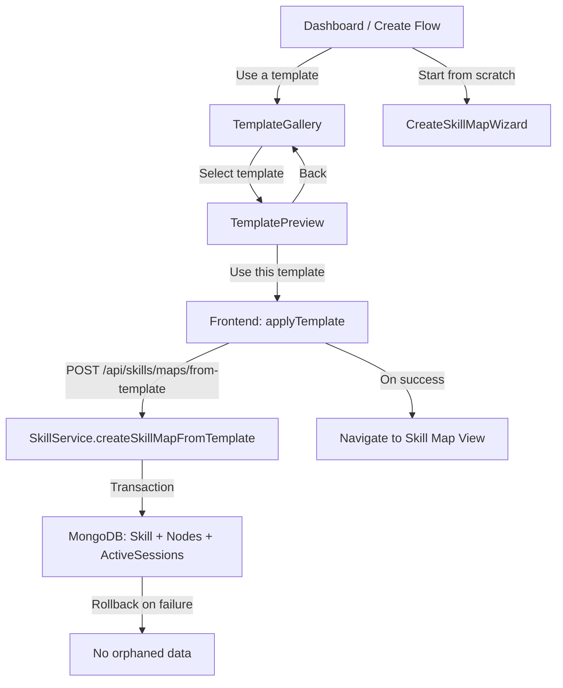

# Design Document: Skill Map Templates

## Overview

The Skill Map Templates feature adds a set of five pre-built skill map blueprints that users can browse, preview, and apply to instantly create a fully populated skill map with pre-built sessions ready to start. Templates are defined as static data on the frontend. When a user applies a template, a new backend endpoint creates the Skill, Nodes, and Active Sessions in a single MongoDB transaction, rolling back entirely on any failure.

Key changes from the initial design:
- **Session_Definitions** are now part of each Node_Definition in the template data, specifying pre-built sessions with titles and descriptions.
- **Backend endpoint** `POST /api/skills/maps/from-template` handles atomic creation of Skill + Nodes + Active Sessions in a transaction.
- **Active session pagination** on the LogPractice page to handle many sessions at once.
- **6-session hard limit removed** from ActiveSessionContext and LogPractice to accommodate template-created sessions.
- **Transaction rollback** ensures partial failures during template application leave no orphaned data.

## Architecture



### Key Design Decisions

1. **Frontend-only template data**: Templates are static constants in `templates.ts`, not stored in MongoDB. No new collections or migrations needed.

2. **New backend endpoint for template application**: Unlike the original design which reused `createSkillMap`, we now need a dedicated `POST /api/skills/maps/from-template` endpoint. This endpoint creates the Skill, Nodes, and Active Sessions atomically in a single MongoDB transaction. The existing `createSkillMap` endpoint remains unchanged for wizard-created maps (no auto-session creation).

3. **Session_Definitions in template data**: Each Node_Definition now includes a `sessions` array of `SessionDefinition` objects (title + description). These are used to auto-create Active Sessions when the template is applied.

4. **Duplicate title handling**: If a user already has a skill map with the same title, the backend appends a numeric suffix (e.g., "Web Dev Basics (2)"). This is handled server-side in the new endpoint.

5. **6-session limit removal**: The `ActiveSessionContext.addSession` method and the LogPractice `tryStart` function currently enforce a 6-session cap. This limit is removed entirely. Pagination is added to the active sessions grid on LogPractice.

6. **Transaction rollback**: The `createSkillMapFromTemplate` method uses a MongoDB session/transaction. If any step fails (Skill creation, Node insertion, or Active Session insertion), the entire transaction is aborted, leaving no orphaned records.

7. **Modal-based UI**: The gallery and preview are rendered as modal dialogs, consistent with the existing `CreateSkillMapWizard` pattern.

## Components and Interfaces

### Frontend Components

#### `templates.ts` — Template Data Module
Location: `frontend/src/data/templates.ts`

Exports the template types and the array of five templates.

```typescript
export interface SessionDefinition {
  title: string;       // 1-100 chars
  description: string; // 0-500 chars
}

export interface NodeDefinition {
  title: string;              // 1-16 chars
  description: string;        // 0-2000 chars
  sessions: SessionDefinition[]; // at least 1
}

export interface SkillMapTemplate {
  id: string;                  // unique identifier
  title: string;               // 1-30 chars (Skill model constraint)
  description: string;         // 0-120 chars (Skill model constraint)
  icon: string;                // valid icon from iconLibrary
  goal: string;                // 1-16 chars (Skill model constraint)
  nodes: NodeDefinition[];     // 2-15 items, each with 1+ sessions
}

export const TEMPLATES: SkillMapTemplate[] = [ /* 5 templates */ ];
```

#### `TemplateGallery` Component
Location: `frontend/src/components/TemplateGallery.jsx`

Props:
- `isOpen: boolean` — controls modal visibility
- `onClose: () => void` — close handler
- `onCreated: ({ skillId, title }) => void` — callback after successful creation
- `onSwitchToWizard: () => void` — switch to CreateSkillMapWizard

State:
- `selectedTemplate: SkillMapTemplate | null` — currently selected template for preview
- `isApplying: boolean` — loading state during template application
- `error: string` — error message from failed application

Behavior:
- Renders template cards in a grid showing icon, title, description, and node count
- Clicking a card sets `selectedTemplate`, showing the `TemplatePreview`
- Provides a "Create from scratch" link that calls `onSwitchToWizard`
- Disables apply button and shows spinner while `isApplying` is true

#### `TemplatePreview` Component
Location: `frontend/src/components/TemplatePreview.jsx`

Props:
- `template: SkillMapTemplate` — the template to preview
- `onBack: () => void` — return to gallery
- `onApply: (template: SkillMapTemplate) => void` — apply the template
- `isApplying: boolean` — loading state
- `error: string` — error message

Behavior:
- Displays template title, description, icon, goal
- Displays total node count and total session count
- Lists all node definitions in order with titles, descriptions, and their session definitions (session titles and descriptions)
- "Use this template" button triggers `onApply`
- "Back" button triggers `onBack`

### Template Application Logic (in TemplateGallery)

```
async function applyTemplate(template):
  1. Set isApplying = true, clear error
  2. POST /api/skills/maps/from-template with { templateId, template data }
  3. On success: call onCreated with the new skill ID and title
  4. On error: set error state, allow retry
  5. Set isApplying = false
```

The backend handles title deduplication and atomic creation, so the frontend simply sends the template data and handles the response.

### Active Session Pagination (LogPractice changes)

The `LogPractice` page currently renders all active sessions in a flat grid. Changes:

1. Add `SESSIONS_PER_PAGE` constant (default: 6) for the active sessions grid
2. Add `sessionPage` state variable (default: 1)
3. Slice `activeSessions` array by page: `activeSessions.slice((sessionPage - 1) * SESSIONS_PER_PAGE, sessionPage * SESSIONS_PER_PAGE)`
4. Render pagination controls (prev/next buttons, page indicator) below the active sessions grid when `activeSessions.length > SESSIONS_PER_PAGE`
5. Display total count: `({activeSessions.length} total)` instead of `({activeSessions.length}/6)`

### 6-Session Limit Removal

Changes in `ActiveSessionContext.jsx`:
- Remove the `if (activeSessions.length >= 6)` guard in `addSession`
- The `addSession` callback no longer returns `null` for exceeding a limit

Changes in `LogPractice.jsx`:
- Remove the `activeSessions.length >= 6` check in `tryStart`
- Remove the `blockMsg` about "at most 6 active sessions"
- Update the count display from `({activeSessions.length}/6)` to `({activeSessions.length} total)`

### Integration Point

The entry point for template selection is wherever the user currently triggers `CreateSkillMapWizard`. The parent component offers two options:
- "Use a template" → opens `TemplateGallery`
- "Start from scratch" → opens `CreateSkillMapWizard`

### Backend: New Endpoint and Service Method

#### Route: `POST /api/skills/maps/from-template`
Location: `backend/src/routes/skills.js`

Request body:
```json
{
  "template": {
    "title": "Web Dev Fundamentals",
    "description": "Learn the core technologies...",
    "icon": "Code",
    "goal": "Build a website",
    "nodes": [
      {
        "title": "HTML Basics",
        "description": "Document structure...",
        "sessions": [
          { "title": "Intro to HTML", "description": "Learn document structure..." },
          { "title": "Forms & Inputs", "description": "Build interactive forms..." }
        ]
      }
    ]
  }
}
```

Response (201):
```json
{
  "skill": { "_id": "...", "name": "Web Dev Fundamentals", ... },
  "nodes": [ ... ],
  "activeSessions": [ ... ]
}
```

Validation (using Zod):
- `template.title`: string, 1-30 chars
- `template.description`: string, 0-120 chars
- `template.icon`: string, 1-30 chars
- `template.goal`: string, 1-16 chars
- `template.nodes`: array of 2-15 items, each with:
  - `title`: string, 1-16 chars
  - `description`: string, 0-2000 chars
  - `sessions`: array of 1+ items, each with:
    - `title`: string, 1-100 chars
    - `description`: string, 0-500 chars

#### Service Method: `SkillService.createSkillMapFromTemplate`

```javascript
async createSkillMapFromTemplate(userId, template) {
  const session = await mongoose.startSession();
  session.startTransaction();
  try {
    // 1. Deduplicate title
    let title = template.title.trim();
    if (await this.skillTitleExistsForUser(userId, title)) {
      let suffix = 2;
      while (await this.skillTitleExistsForUser(userId, `${title} (${suffix})`)) {
        suffix++;
      }
      title = `${title} (${suffix})`;
    }

    // 2. Create Skill
    const skill = new Skill({
      userId, name: title, nodeCount: template.nodes.length,
      description: template.description || '',
      icon: template.icon || 'Map',
      goal: template.goal || '', status: 'active'
    });
    await skill.save({ session });

    // 3. Create Nodes
    const nodes = template.nodes.map((nd, i) => new Node({
      skillId: skill._id, userId, order: i + 1,
      title: nd.title.trim(), description: nd.description || '',
      status: i === 0 ? 'Unlocked' : 'Locked',
      isStart: i === 0, isGoal: false
    }));
    await Node.insertMany(nodes, { session });

    // 4. Create Active Sessions for each node's session definitions
    const activeSessions = [];
    for (const [nodeIndex, nodeDef] of template.nodes.entries()) {
      for (const sessDef of nodeDef.sessions) {
        activeSessions.push(new ActiveSession({
          userId,
          skillName: `${title} — ${nodes[nodeIndex].title}`,
          tags: [],
          notes: sessDef.description || '',
          timer: 0, targetTime: 1500, // 25 min default
          isCountdown: true, isRunning: false,
          nodeId: nodes[nodeIndex]._id.toString(),
          skillId: skill._id.toString(),
          startedAt: new Date()
        }));
      }
    }
    await ActiveSession.insertMany(activeSessions, { session });

    // 5. Commit
    await session.commitTransaction();
    return {
      skill: skill.toObject(),
      nodes: nodes.map(n => n.toObject()),
      activeSessions: activeSessions.map(s => s.toObject())
    };
  } catch (error) {
    await session.abortTransaction();
    throw error;
  } finally {
    session.endSession();
  }
}
```

Key points:
- The entire operation (Skill + Nodes + Active Sessions) is wrapped in a single MongoDB transaction.
- If `ActiveSession.insertMany` fails partway through, the transaction aborts and no Skill or Nodes are persisted.
- Title deduplication happens inside the transaction to avoid race conditions.
- The existing `createSkillMap` method is NOT modified — it continues to work as before for wizard-created maps (no auto-session creation), preserving Requirement 6.6.

## Data Models

### Template Data (Frontend Static)

```typescript
// Example: Web Development Fundamentals template with Session_Definitions
{
  id: "web-dev-fundamentals",
  title: "Web Dev Fundamentals",
  description: "Learn the core technologies of the web from HTML to deployment",
  icon: "Code",
  goal: "Build a website",
  nodes: [
    {
      title: "HTML Basics",
      description: "Document structure, semantic elements, forms, and accessibility fundamentals",
      sessions: [
        { title: "Document Structure", description: "Learn HTML5 document structure, head/body, and semantic tags" },
        { title: "Forms & Inputs", description: "Build forms with validation, input types, and accessibility" }
      ]
    },
    {
      title: "CSS Styling",
      description: "Selectors, box model, flexbox, grid, and responsive design patterns",
      sessions: [
        { title: "Box Model & Selectors", description: "Master the CSS box model, specificity, and selector patterns" },
        { title: "Flexbox & Grid", description: "Build responsive layouts with flexbox and CSS grid" }
      ]
    },
    {
      title: "JavaScript Core",
      description: "Variables, functions, DOM manipulation, events, and async programming",
      sessions: [
        { title: "Variables & Functions", description: "Learn let/const, arrow functions, and scope" },
        { title: "DOM & Events", description: "Manipulate the DOM, handle events, and build interactive pages" }
      ]
    },
    {
      title: "Git & GitHub",
      description: "Version control basics, branching, merging, and collaboration workflows",
      sessions: [
        { title: "Git Basics", description: "Init, add, commit, push, and pull workflows" },
        { title: "Branching & PRs", description: "Create branches, resolve conflicts, and open pull requests" }
      ]
    },
    {
      title: "React Intro",
      description: "Components, props, state, hooks, and building interactive UIs",
      sessions: [
        { title: "Components & Props", description: "Build reusable components and pass data with props" },
        { title: "State & Hooks", description: "Manage state with useState and useEffect" }
      ]
    },
    {
      title: "Deploy & Ship",
      description: "Build tools, hosting platforms, CI/CD basics, and going live",
      sessions: [
        { title: "Build & Bundle", description: "Configure build tools and optimize for production" },
        { title: "Deploy to Cloud", description: "Deploy to a hosting platform and set up CI/CD" }
      ]
    }
  ]
}
```

The remaining four templates (Guitar Practice Path, Spanish Basics, Data Science Intro, UI Design Basics) follow the same structure with domain-appropriate Session_Definitions. Each node has 1-3 sessions.

### Existing Models (Unchanged)

- **Skill** — `name` (1-30), `description` (0-120), `icon` (max 30), `goal` (0-16), `nodeCount`, `userId`, `status`
- **Node** — `skillId`, `userId`, `order` (1+), `title` (max 16), `description` (max 2000), `status`, `isStart`, `isGoal`
- **ActiveSession** — `userId`, `skillName` (max 100), `tags`, `notes` (max 1000), `timer`, `targetTime`, `isCountdown`, `isRunning`, `nodeId`, `skillId`, `startedAt`

Template data is designed to fit within these existing constraints. No schema changes required.

### Frontend API Addition

Add to `frontend/src/api/skillMapApi.ts` or `frontend/src/services/api.js`:

```typescript
export async function createSkillMapFromTemplate(template: SkillMapTemplate): Promise<{
  skill: any;
  nodes: any[];
  activeSessions: any[];
}> {
  const { data } = await client.post('/skills/maps/from-template', { template });
  return data;
}
```

## Correctness Properties

*A property is a characteristic or behavior that should hold true across all valid executions of a system — essentially, a formal statement about what the system should do. Properties serve as the bridge between human-readable specifications and machine-verifiable correctness guarantees.*

### Property 1: Template structure conforms to model constraints

*For any* template in the TEMPLATES array, the template's title must be 1-30 characters, description must be 0-120 characters, goal must be 1-16 characters, icon must be a valid identifier from the icon library, the nodes array must have between 4 and 8 entries, each node definition must have a title of 1-16 characters, a description of 0-2000 characters, and at least one session definition. Each session definition must have a title of 1-100 characters and a description of 0-500 characters.

**Validates: Requirements 1.1, 1.2, 1.3, 1.4, 1.5, 2.7, 11.1, 11.2, 11.3, 11.4, 11.5, 11.6**

### Property 2: Template IDs are unique

*For any* two distinct templates in the TEMPLATES array, their `id` fields must be different.

**Validates: Requirements 1.6**

### Property 3: Template JSON round-trip

*For any* template in the TEMPLATES array, serializing the template to JSON and parsing it back should produce a deeply equal object.

**Validates: Requirements 1.7**

### Property 4: Template application produces a valid skill map with correct nodes

*For any* template, when applied via `createSkillMapFromTemplate`, the resulting Skill document should have a title matching the template title (or a deduplicated variant), description matching the template description, icon matching the template icon, and goal matching the template goal. The resulting Node documents should match the template's node definitions in count and order (by title), with the first node having status "Unlocked" and all subsequent nodes having status "Locked". No other skill maps should be created.

**Validates: Requirements 5.1, 5.2, 5.3, 5.7, 11.7**

### Property 5: Template application creates correct sessions for all nodes

*For any* template, when applied via `createSkillMapFromTemplate`, the total number of created Active Sessions should equal the sum of all Session_Definitions across all Node_Definitions. Each created Active Session should have a `skillName` containing the corresponding node title, a `notes` field matching the Session_Definition description, a `nodeId` referencing the correct Node, a `skillId` referencing the created Skill, and a `userId` matching the applying user.

**Validates: Requirements 6.1, 6.2, 6.3, 6.4**

### Property 6: Title deduplication produces unique titles

*For any* template title and *for any* set of existing skill map titles belonging to a user, the deduplication function should produce a title that does not exist in the set of existing titles. Additionally, if the original title is not in the existing set, the function should return the original title unchanged.

**Validates: Requirements 5.4**

### Property 7: Template preview displays all template data

*For any* template, the rendered TemplatePreview component should display the template title, description, icon, goal, all node definitions in order with their titles and descriptions, all session definitions for each node with their titles and descriptions, the total node count, and the total session count.

**Validates: Requirements 3.2, 4.1, 4.2, 4.3, 4.6**

### Property 8: Active session pagination correctness

*For any* list of active sessions and *for any* valid page number, the paginated slice should contain at most `SESSIONS_PER_PAGE` items, the items should be the correct subset of the full list for that page, and the total page count should equal `ceil(totalSessions / SESSIONS_PER_PAGE)`.

**Validates: Requirements 9.1**

### Property 9: Rollback on partial failure leaves no orphaned data

*For any* template application where session creation fails partway through, the database should contain no Skill, Node, or Active Session records from that failed operation. The count of Skills, Nodes, and Active Sessions should be the same before and after the failed operation.

**Validates: Requirements 12.4**

## Error Handling

### Template Application Errors

| Error Scenario | Handling | User Feedback |
|---|---|---|
| Network error during `createSkillMapFromTemplate` | Catch in `applyTemplate`, set error state | Display error message with retry button |
| Validation error (400) | Should not occur since templates are pre-validated; log and show generic error | "Something went wrong. Please try again." |
| Partial session creation failure | Backend transaction rolls back Skill + Nodes + Sessions | "Failed to create skill map. Please try again." |
| Server error (500) | Catch and display | "Server error. Please try again later." |
| Duplicate title conflict | Backend handles deduplication automatically in transaction | No user-facing error — title is auto-suffixed |

### UI State Errors

| Error Scenario | Handling |
|---|---|
| Double-click on "Use this template" | Disable button and show spinner while `isApplying` is true |
| User closes modal during application | Allow close; if creation succeeds in background, skill list will update on next load |

### Template Data Integrity

Templates are static constants. Data integrity is caught at build time through TypeScript type checking and at test time through property-based tests (Property 1). No runtime template loading errors are expected.

### Transaction Rollback Details

The `createSkillMapFromTemplate` method uses `mongoose.startSession()` and `session.startTransaction()`. The transaction covers:
1. Skill document creation
2. Node documents insertion (via `insertMany`)
3. Active Session documents insertion (via `insertMany`)

If any step throws, `session.abortTransaction()` is called, which rolls back all three operations atomically. This ensures Requirement 12.4 is satisfied.

## Testing Strategy

### Property-Based Testing

Library: **fast-check** (already available in both `backend` and `frontend` devDependencies)

Each property test must run a minimum of 100 iterations and be tagged with a comment referencing the design property.

| Property | Test Location | Description |
|---|---|---|
| Property 1: Template structure | `frontend/src/data/__tests__/templates.property.test.ts` | Validate all templates conform to model constraints including session definitions |
| Property 2: Template ID uniqueness | `frontend/src/data/__tests__/templates.property.test.ts` | Verify no duplicate IDs |
| Property 3: JSON round-trip | `frontend/src/data/__tests__/templates.property.test.ts` | Serialize/deserialize all templates |
| Property 4: Template application (skill + nodes) | `backend/src/services/__tests__/templateApplication.property.test.js` | Apply each template and verify Skill + Nodes output |
| Property 5: Template application (sessions) | `backend/src/services/__tests__/templateApplication.property.test.js` | Apply each template and verify Active Sessions output |
| Property 6: Title deduplication | `frontend/src/data/__tests__/templates.property.test.ts` | Generate random existing title sets and verify uniqueness |
| Property 7: Template preview rendering | `frontend/src/components/__tests__/TemplatePreview.property.test.jsx` | Render preview for each template and verify all data is displayed |
| Property 8: Pagination correctness | `frontend/src/components/__tests__/LogPractice.property.test.jsx` | Generate random session lists and verify pagination slicing |
| Property 9: Rollback on failure | `backend/src/services/__tests__/templateApplication.property.test.js` | Simulate failures and verify no orphaned data |

Configuration:
- Each test runs with `{ numRuns: 100 }` minimum
- Tag format: `Feature: skill-map-templates, Property N: <property text>`

### Unit Testing

Unit tests complement property tests by covering specific examples and edge cases:

| Test | Location | What it covers |
|---|---|---|
| Template count is exactly 5 | `frontend/src/data/__tests__/templates.test.ts` | Requirement 2.1 |
| Each domain template exists | `frontend/src/data/__tests__/templates.test.ts` | Requirements 2.2-2.6 |
| TemplateGallery renders all cards | `frontend/src/components/__tests__/TemplateGallery.test.jsx` | Requirement 3.2 |
| TemplateGallery shows "Create from scratch" link | `frontend/src/components/__tests__/TemplateGallery.test.jsx` | Requirement 3.4 |
| TemplatePreview shows apply and back buttons | `frontend/src/components/__tests__/TemplatePreview.test.jsx` | Requirements 4.4, 4.5 |
| Apply button disabled during loading | `frontend/src/components/__tests__/TemplateGallery.test.jsx` | Requirement 12.1 |
| Error message displayed on failure | `frontend/src/components/__tests__/TemplateGallery.test.jsx` | Requirements 5.6, 12.2 |
| Loading skeleton shown while loading | `frontend/src/components/__tests__/TemplateGallery.test.jsx` | Requirement 12.3 |
| Sessions appear on LogPractice after template apply | `frontend/src/pages/__tests__/LogPractice.test.jsx` | Requirement 6.5 |
| Non-template skill maps don't auto-create sessions | `backend/src/services/__tests__/SkillService.test.js` | Requirement 6.6 |
| More than 6 sessions allowed | `frontend/src/context/__tests__/ActiveSessionContext.test.jsx` | Requirements 10.1, 10.2 |
| Total session count displayed | `frontend/src/pages/__tests__/LogPractice.test.jsx` | Requirement 10.4 |
| Pagination controls shown when needed | `frontend/src/pages/__tests__/LogPractice.test.jsx` | Requirements 9.2, 9.3, 9.4 |
| Title deduplication edge cases | `frontend/src/data/__tests__/templates.test.ts` | Requirement 5.4 (empty set, single collision, multiple collisions) |

### Testing Balance

- Property tests handle comprehensive input coverage for template validation, title deduplication, template application correctness, pagination logic, and rollback behavior
- Unit tests handle specific examples (exact template count, domain coverage), UI behavior (loading states, error display, navigation), and edge cases
- Integration between template data and the new `createSkillMapFromTemplate` backend method is validated by Properties 4, 5, and 9
