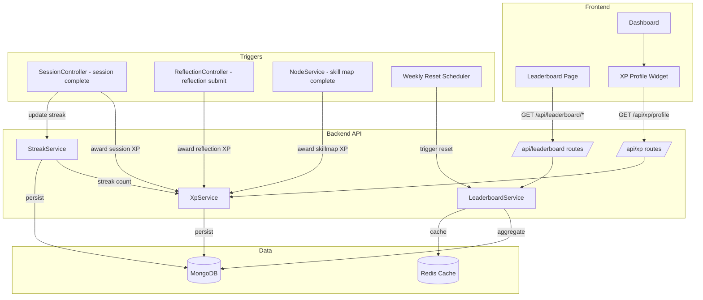

# Design Document: XP Leaderboard System

## Overview

The XP Leaderboard System adds gamification to LearnLoop by introducing experience points (XP), practice streaks, and competitive leaderboards. The system integrates with existing session completion, reflection submission, and skill map completion flows to award XP. Three backend services (XP Service, Streak Service, Leaderboard Service) handle the core logic, exposing REST endpoints consumed by two new frontend pages (Leaderboard Page) and a new dashboard widget (XP Profile).

Key design decisions:
- XP is tracked via an append-only `XpTransaction` collection for auditability; a denormalized `totalXp` field on a `UserXpProfile` document provides fast reads.
- Streak tracking lives on a dedicated `UserStreak` document per user, updated on session completion.
- Leaderboard rankings are computed from aggregated data and cached in Redis (already available via `CacheService`) with a 5-minute TTL.
- Weekly reset is executed by a scheduled job (cron or a lightweight in-process timer) every Monday 00:00 UTC.
- The 7-day streak multiplier (×2) is applied at XP award time and recorded on each transaction.

## Architecture



The system hooks into three existing flows:
1. **Session completion** (via `SessionCompletionEngine` / session routes): triggers session XP + streak update + streak bonus XP.
2. **Reflection submission** (via reflection routes): triggers reflection XP.
3. **Skill map completion** (via `NodeService` when last node completes): triggers skill map completion XP.

All XP awards flow through `XpService.awardXp()`, which checks daily caps, applies the streak multiplier, persists the transaction, and updates the denormalized total.

## Components and Interfaces

### Backend Services

#### XpService

Location: `backend/src/services/XpService.js`

```js
class XpService {
  /**
   * Award XP to a user. Checks daily caps, applies streak multiplier, persists transaction.
   * @param {string} userId
   * @param {string} source - 'session_completion' | 'reflection' | 'streak_bonus' | 'skillmap_completion'
   * @param {number} baseAmount - positive integer
   * @param {object} metadata - { streakDay?, skillMapId?, nodeId? }
   * @returns {Promise<XpTransaction|null>} - null if daily cap already reached for this source
   */
  static async awardXp(userId, source, baseAmount, metadata = {}) {}

  /**
   * Get a user's XP profile (total XP, weekly XP, streak, tier, rank).
   * @param {string} userId
   * @returns {Promise<object>}
   */
  static async getProfile(userId) {}

  /**
   * Recalculate a user's totalXp from transactions (consistency check).
   * @param {string} userId
   * @returns {Promise<number>}
   */
  static async recalculateTotalXp(userId) {}
}
```

#### StreakService

Location: `backend/src/services/StreakService.js`

```js
class StreakService {
  /**
   * Process a qualifying session completion for streak tracking.
   * Increments streak if consecutive day, resets to 1 if gap, no-ops if same day.
   * @param {string} userId
   * @param {Date} sessionDate
   * @returns {Promise<{ streakCount: number, isNewDay: boolean }>}
   */
  static async processSession(userId, sessionDate) {}

  /**
   * Get current streak info for a user.
   * @param {string} userId
   * @returns {Promise<{ currentStreak: number, lastPracticeDate: Date|null }>}
   */
  static async getStreak(userId) {}
}
```

#### LeaderboardService

Location: `backend/src/services/LeaderboardService.js`

```js
class LeaderboardService {
  /**
   * Get weekly XP leaderboard (paginated, cached).
   * @param {number} page - 1-indexed
   * @param {number} pageSize - default 50
   * @returns {Promise<{ entries: LeaderboardEntry[], total: number, page: number }>}
   */
  static async getWeeklyBoard(page = 1, pageSize = 50) {}

  /**
   * Get streak leaderboard (paginated, cached).
   */
  static async getStreakBoard(page = 1, pageSize = 50) {}

  /**
   * Get all-time XP leaderboard (paginated, cached).
   */
  static async getAllTimeBoard(page = 1, pageSize = 50) {}

  /**
   * Get a specific user's rank on each board.
   * @param {string} userId
   * @returns {Promise<{ weeklyRank, streakRank, allTimeRank }>}
   */
  static async getUserRanks(userId) {}

  /**
   * Assign league tier based on weekly rank.
   * @param {number} rank
   * @returns {'Gold'|'Silver'|'Bronze'|'Newcomer'}
   */
  static getTierForRank(rank) {}

  /**
   * Execute weekly reset: reset weekly XP, apply promotion/relegation, persist history.
   */
  static async executeWeeklyReset() {}
}
```

### Backend Routes

#### XP Routes (`/api/xp`)

| Method | Path | Description |
|--------|------|-------------|
| GET | `/api/xp/profile` | Get current user's XP profile |
| GET | `/api/xp/transactions` | Get current user's recent XP transactions |

#### Leaderboard Routes (`/api/leaderboard`)

| Method | Path | Description |
|--------|------|-------------|
| GET | `/api/leaderboard/weekly?page=1` | Weekly XP leaderboard |
| GET | `/api/leaderboard/streaks?page=1` | Streak leaderboard |
| GET | `/api/leaderboard/all-time?page=1` | All-time XP leaderboard |
| GET | `/api/leaderboard/my-ranks` | Current user's ranks across all boards |

### Frontend Components

#### LeaderboardPage

Location: `frontend/src/pages/Leaderboard.jsx`

- Three tabs: "Weekly XP", "Streaks", "All-Time"
- Defaults to "Weekly XP" tab
- Shows current user's rank pinned at top
- Pagination controls for 50-entry pages
- Accessible from Sidebar navigation

#### XpProfileCard

Location: `frontend/src/components/XpProfileCard.jsx`

- Displays: total XP, current streak (days), league tier icon, weekly XP, weekly rank
- Shows "×2 XP Active" badge when streak ≥ 7
- Used on Dashboard and Leaderboard page

#### LeaderboardTable

Location: `frontend/src/components/LeaderboardTable.jsx`

- Reusable table component for all three leaderboard views
- Highlights current user's row
- Columns: rank, display name, metric value (XP or streak days)
- Tier badge on weekly view

## Data Models

### XpTransaction

Collection: `xpTransactions`

```js
const XpTransactionSchema = new mongoose.Schema({
  userId: { type: String, required: true, index: true },
  source: {
    type: String,
    required: true,
    enum: ['session_completion', 'reflection', 'streak_bonus', 'skillmap_completion']
  },
  baseAmount: { type: Number, required: true, min: 1 },
  multiplier: { type: Number, required: true, enum: [1, 2] },
  finalAmount: { type: Number, required: true, min: 1 },
  referenceId: { type: String, default: null },  // nodeId, skillMapId, etc.
  metadata: { type: mongoose.Schema.Types.Mixed, default: {} }, // { streakDay, etc. }
}, { timestamps: true });

XpTransactionSchema.index({ userId: 1, createdAt: -1 });
XpTransactionSchema.index({ userId: 1, source: 1, createdAt: -1 });
```

### UserXpProfile

Collection: `userXpProfiles`

Denormalized document for fast reads. Updated atomically on each XP award.

```js
const UserXpProfileSchema = new mongoose.Schema({
  userId: { type: String, required: true, unique: true },
  totalXp: { type: Number, default: 0, min: 0 },
  weeklyXp: { type: Number, default: 0, min: 0 },
  weekStartDate: { type: Date, required: true }, // Monday 00:00 UTC of current week
  leagueTier: {
    type: String,
    enum: ['Gold', 'Silver', 'Bronze', 'Newcomer'],
    default: 'Newcomer'
  },
}, { timestamps: true });

UserXpProfileSchema.index({ weeklyXp: -1 });
UserXpProfileSchema.index({ totalXp: -1 });
UserXpProfileSchema.index({ leagueTier: 1 });
```

### UserStreak

Collection: `userStreaks`

```js
const UserStreakSchema = new mongoose.Schema({
  userId: { type: String, required: true, unique: true },
  currentStreak: { type: Number, default: 0, min: 0 },
  lastPracticeDate: { type: Date, default: null }, // calendar day (UTC) of last qualifying session
  streakStartDate: { type: Date, default: null },
}, { timestamps: true });

UserStreakSchema.index({ currentStreak: -1 });
```

### WeeklyResetHistory

Collection: `weeklyResetHistories`

```js
const WeeklyResetHistorySchema = new mongoose.Schema({
  weekEndDate: { type: Date, required: true }, // Sunday 23:59 UTC of the week that ended
  promotions: [{ userId: String, fromTier: String, toTier: String }],
  relegations: [{ userId: String, fromTier: String, toTier: String }],
  totalRankedUsers: { type: Number, default: 0 },
}, { timestamps: true });
```

### Daily XP Cap Tracking

Rather than a separate collection, `XpService.awardXp()` queries `XpTransaction` for existing transactions with the same `userId`, `source`, and `createdAt` within the current UTC day. This avoids an extra model while keeping the daily-cap logic simple and auditable.


## Correctness Properties

*A property is a characteristic or behavior that should hold true across all valid executions of a system — essentially, a formal statement about what the system should do. Properties serve as the bridge between human-readable specifications and machine-verifiable correctness guarantees.*

### Property 1: Session XP threshold

*For any* practice session and any minutesPracticed value, calling `XpService.awardXp` for source `session_completion` should award 10 base XP if and only if `minutesPracticed >= 10`; otherwise it should award 0 XP.

**Validates: Requirements 1.1, 1.2**

### Property 2: Daily XP cap per source

*For any* user, any XP source with a daily cap (`session_completion`, `reflection`, `streak_bonus`), and any number of qualifying actions on the same UTC calendar day, at most one XP transaction of that source type should be created for that user on that day.

**Validates: Requirements 1.3, 1.4, 3.2, 3.3, 4.4**

### Property 3: Streak bonus formula

*For any* user with a current streak count of N (where N ≥ 1), the streak bonus XP base amount should equal `5 * N`.

**Validates: Requirements 4.1, 4.2, 4.3**

### Property 4: Skill map completion XP — template only

*For any* completed skill map, `XpService.awardXp` for source `skillmap_completion` should award 200 base XP if and only if the skill map is a Template_Skill_Map; for non-template skill maps, no XP transaction should be created.

**Validates: Requirements 5.1, 5.2**

### Property 5: Skill map completion uniqueness

*For any* user and any Template_Skill_Map, at most one XP transaction with source `skillmap_completion` and the corresponding skillMapId should exist, regardless of how many times completion is triggered.

**Validates: Requirements 5.3**

### Property 6: Streak multiplier assignment

*For any* user and any XP award event, the multiplier applied should be 2 if the user's current Practice_Streak is ≥ 7, and 1 otherwise. This applies uniformly to all XP sources.

**Validates: Requirements 6.1, 6.2, 6.3**

### Property 7: Transaction amount invariant

*For any* XP transaction, `finalAmount` should equal `baseAmount × multiplier`.

**Validates: Requirements 6.5**

### Property 8: Streak increment on consecutive day

*For any* user with `lastPracticeDate = D` and `currentStreak = S`, processing a qualifying session on date `D + 1` should result in `currentStreak = S + 1` and `lastPracticeDate = D + 1`.

**Validates: Requirements 7.1**

### Property 9: Streak reset on gap

*For any* user with `lastPracticeDate = D`, processing a qualifying session on a date more than 1 day after D should result in `currentStreak = 1`.

**Validates: Requirements 7.2, 7.5**

### Property 10: Streak idempotence on same day

*For any* user, processing multiple qualifying sessions on the same UTC calendar day should not change the streak count after the first session of that day is processed. Formally: `processSession(userId, date)` called twice with the same date should produce the same streak state as calling it once.

**Validates: Requirements 7.3**

### Property 11: Leaderboard sorting invariant

*For any* leaderboard result (weekly, streak, or all-time), for every consecutive pair of entries `(entries[i], entries[i+1])`, the metric value of `entries[i]` should be ≥ the metric value of `entries[i+1]`.

**Validates: Requirements 8.2, 11.1, 12.2**

### Property 12: Weekly board inclusion

*For any* user who has at least one XP transaction within the current week (Monday 00:00 UTC to Sunday 23:59 UTC), that user should appear on the Weekly_XP_Board.

**Validates: Requirements 8.4**

### Property 13: Streak board exclusion of zero streaks

*For any* entry on the Streak_Board, the streak count should be ≥ 1. No user with a streak of 0 should appear.

**Validates: Requirements 11.4**

### Property 14: Tier assignment from rank

*For any* rank value, `getTierForRank(rank)` should return: `'Gold'` for ranks 1–10, `'Silver'` for ranks 11–30, `'Bronze'` for ranks 31–100, and `'Newcomer'` for ranks > 100 or rank 0 (no weekly XP).

**Validates: Requirements 9.1, 9.2, 9.3, 9.4**

### Property 15: Weekly reset zeroes weekly XP

*For any* set of UserXpProfile documents with non-zero weeklyXp, after executing `executeWeeklyReset()`, all profiles should have `weeklyXp = 0`.

**Validates: Requirements 10.2**

### Property 16: Promotion from Silver to Gold

*For any* weekly reset where the Silver tier has ≥ 4 users, the top 3 Silver users by weekly XP should be promoted to Gold tier.

**Validates: Requirements 10.3, 10.6**

### Property 17: Relegation from Gold to Silver

*For any* weekly reset where the Gold tier has ≥ 4 users, the bottom 3 Gold users by weekly XP should be relegated to Silver tier.

**Validates: Requirements 10.4, 10.5**

### Property 18: XP total consistency invariant

*For any* user, the sum of all `finalAmount` values across their XP transactions should equal the `totalXp` stored on their UserXpProfile document.

**Validates: Requirements 16.2, 16.5**

### Property 19: Transaction validation

*For any* attempt to create an XP transaction, if `baseAmount` is not a positive integer or `multiplier` is not 1 or 2, the transaction should be rejected (not persisted).

**Validates: Requirements 16.4**

### Property 20: Pagination page size

*For any* leaderboard request with page size 50, the returned entries array should have at most 50 elements.

**Validates: Requirements 15.1**

### Property 21: XP profile multiplier indicator

*For any* XP profile data, the "×2 XP Active" indicator should be shown if and only if the user's current streak is ≥ 7.

**Validates: Requirements 13.6**

### Property 22: Reflection XP award

*For any* valid reflection submission (containing mood and content), `XpService.awardXp` should award 20 base XP with source `reflection`.

**Validates: Requirements 3.1**

### Property 23: XP transaction structure completeness

*For any* persisted XP transaction, the document should contain non-null values for: `userId`, `source`, `baseAmount`, `multiplier`, `finalAmount`, and `createdAt`.

**Validates: Requirements 1.5, 3.4, 4.5, 5.4, 6.4, 16.1**

## Error Handling

### Backend Error Handling

| Scenario | Handling |
|----------|----------|
| XP transaction fails to persist | Retry once, log error via `ErrorLoggingService`, return gracefully without blocking the triggering action (session completion, reflection, etc.) |
| Invalid XP award parameters | Reject with validation error before persisting; log warning |
| Streak update fails | Log error, do not block session completion; streak will self-correct on next session |
| Leaderboard aggregation timeout | Return cached data if available; if no cache, return 503 with retry-after header |
| Weekly reset failure | Log critical error, retry on next scheduler tick; persist partial progress to avoid duplicate promotions/relegations |
| Redis cache unavailable | Fall through to direct MongoDB queries (already handled by existing `CacheService` pattern) |
| Concurrent XP awards for same user | Use MongoDB `$inc` for atomic updates to `totalXp` and `weeklyXp` on `UserXpProfile` to avoid race conditions |

### Frontend Error Handling

| Scenario | Handling |
|----------|----------|
| Leaderboard API fails | Show error message with "Retry" button; preserve current tab state |
| XP Profile API fails | Show "XP data unavailable" fallback with retry option |
| Slow leaderboard load | Show skeleton loading state (animated placeholders for rows) |
| Slow XP profile load | Show placeholder content with pulse animation |
| Pagination request fails | Show error inline, keep current page data visible |

## Testing Strategy

### Unit Tests

Unit tests cover specific examples, edge cases, and integration points:

- XP award for exactly 10 minutes (boundary)
- XP award for 9 minutes (no award)
- Streak bonus at day 1 (5 XP) and day 5 (25 XP)
- Tier assignment at boundaries (rank 10 → Gold, rank 11 → Silver, rank 30 → Silver, rank 31 → Bronze, rank 100 → Bronze, rank 101 → Newcomer)
- Weekly reset with fewer than 4 Gold users (no relegation)
- Weekly reset with fewer than 4 Silver users (no promotion)
- Tiebreaker: two users with same weekly XP, earlier first-transaction wins
- Tiebreaker: two users with same streak, earlier streak-start wins
- Tiebreaker: two users with same all-time XP, earlier registration wins
- Skill map completion XP for template vs non-template
- Cache hit and cache miss scenarios for leaderboard
- XP transaction retry on first persist failure
- Weekly reset history record creation
- Leaderboard page tab switching (default to Weekly XP)
- Loading and error states render correctly

### Property-Based Tests

Property-based tests use `fast-check` (already in devDependencies for both backend and frontend) to verify universal properties across randomly generated inputs. Each property test runs a minimum of 100 iterations.

Each test is tagged with a comment referencing the design property:
```
// Feature: xp-leaderboard-system, Property {N}: {property title}
```

Backend property tests (using `fast-check` with Jest):
- Property 1: Session XP threshold
- Property 2: Daily XP cap per source
- Property 3: Streak bonus formula
- Property 4: Skill map completion XP — template only
- Property 5: Skill map completion uniqueness
- Property 6: Streak multiplier assignment
- Property 7: Transaction amount invariant
- Property 8: Streak increment on consecutive day
- Property 9: Streak reset on gap
- Property 10: Streak idempotence on same day
- Property 11: Leaderboard sorting invariant
- Property 14: Tier assignment from rank
- Property 15: Weekly reset zeroes weekly XP
- Property 16: Promotion from Silver to Gold
- Property 17: Relegation from Gold to Silver
- Property 18: XP total consistency invariant
- Property 19: Transaction validation
- Property 20: Pagination page size
- Property 22: Reflection XP award
- Property 23: XP transaction structure completeness

Frontend property tests (using `fast-check` with Vitest):
- Property 12: Weekly board inclusion (data layer)
- Property 13: Streak board exclusion of zero streaks (data layer)
- Property 21: XP profile multiplier indicator

Each correctness property above is implemented by a single property-based test. Unit tests complement these by covering the specific edge cases and examples identified in the prework (tiebreakers, boundary ranks, loading/error UI states, tab navigation defaults).
